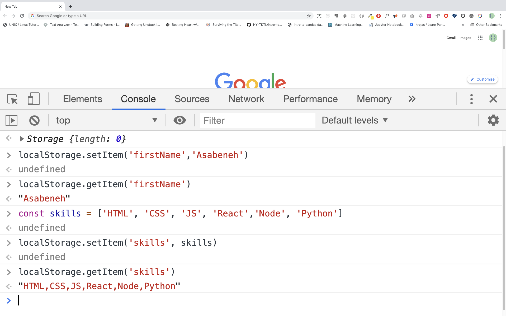

# Day 16

## JSON

JSON stands for JavaScript Object Notation. The JSON syntax is derived from JavaScript object notation syntax, but the JSON format is text or string only. JSON is a light weight data format for storing and transporting. JSON is mostly used when data is sent from a server to a client. JSON is an easier-to-use alternative to XML.

**Example:**

```js
{
"users":[
  {
    "firstName":"Asabeneh",
    "lastName":"Yetayeh",
    "age":250,
    "email":"asab@asb.com"
  },
  {
    "firstName":"Alex",
    "lastName":"James",
    "age":25,
    "email":"alex@alex.com"
  },
  {
  "firstName":"Lidiya",
  "lastName":"Tekle",
  "age":28,
  "email":"lidiya@lidiya.com"
  }
]
}
```

The above JSON example is not much different for a normal object. Then, what is the difference ? The difference is the key of a JSON object should be with double quotes or it should be a string. JavaScript Object and JSON are very similar that we can change JSON to Object and Object to JSON.

Let us see the above example in more detail, it starts with a curly bracket. Inside the curly bracket, there is "users" key which has a value array. Inside the array we have different objects and each objects has keys, each keys has to have double quotes. For instance, we use "firstNaMe" instead of just firstName, however in object we use keys without double quotes. This is the major difference between an object and a JSON. Let's see more examples about JSON.

**Example:**

```js
{
    "Alex": {
        "email": "alex@alex.com",
        "skills": [
            "HTML",
            "CSS",
            "JavaScript"
        ],
        "age": 20,
        "isLoggedIn": false,
        "points": 30
    },
    "Asab": {
        "email": "asab@asab.com",
        "skills": [
            "HTML",
            "CSS",
            "JavaScript",
            "Redux",
            "MongoDB",
            "Express",
            "React",
            "Node"
        ],
        "age": 25,
        "isLoggedIn": false,
        "points": 50
    },
    "Brook": {
        "email": "daniel@daniel.com",
        "skills": [
            "HTML",
            "CSS",
            "JavaScript",
            "React",
            "Redux"
        ],
        "age": 30,
        "isLoggedIn": true,
        "points": 50
    },
    "Daniel": {
        "email": "daniel@alex.com",
        "skills": [
            "HTML",
            "CSS",
            "JavaScript",
            "Python"
        ],
        "age": 20,
        "isLoggedIn": false,
        "points": 40
    },
    "John": {
        "email": "john@john.com",
        "skills": [
            "HTML",
            "CSS",
            "JavaScript",
            "React",
            "Redux",
            "Node.js"
        ],
        "age": 20,
        "isLoggedIn": true,
        "points": 50
    },
    "Thomas": {
        "email": "thomas@thomas.com",
        "skills": [
            "HTML",
            "CSS",
            "JavaScript",
            "React"
        ],
        "age": 20,
        "isLoggedIn": false,
        "points": 40
    },
    "Paul": {
        "email": "paul@paul.com",
        "skills": [
            "HTML",
            "CSS",
            "JavaScript",
            "MongoDB",
            "Express",
            "React",
            "Node"
        ],
        "age": 20,
        "isLoggedIn": false,
        "points": 40
    }
}
```

### Converting JSON to JavaScript Object

Mostly we fetch JSON data from HTTP response or from a file, but we can store the JSON as a string and we can change to Object for sake of demonstration. In JavaScript the keyword _JSON_ has _parse()_ and _stringify()_ methods. When we want to change the JSON to an object we parse the JSON using _JSON.parse()_. When we want to change the object to JSON we use _JSON.stringify()_.

#### JSON.parse()

```js
JSON.parse(json[, reviver])
// json or text , the data
// reviver is an optional callback function
```

```js
const usersText = `{
"users":[
  {
    "firstName":"Asabeneh",
    "lastName":"Yetayeh",
    "age":250,
    "email":"asab@asb.com"
  },
  {
    "firstName":"Alex",
    "lastName":"James",
    "age":25,
    "email":"alex@alex.com"
  },
  {
  "firstName":"Lidiya",
  "lastName":"Tekle",
  "age":28,
  "email":"lidiya@lidiya.com"
  }
]
}`

const usersObj = JSON.parse(usersText, undefined, 4)
console.log(usersObj)
```

### Using a reviver function with JSON.parse()

To use the reviver function as a formatter, we put the keys we want to format first name and last name value. Let us say, we are interested to format the firstName and lastName of the JSON data .

```js
const usersText = `{
"users":[
  {
    "firstName":"Asabeneh",
    "lastName":"Yetayeh",
    "age":250,
    "email":"asab@asb.com"
  },
  {
    "firstName":"Alex",
    "lastName":"James",
    "age":25,
    "email":"alex@alex.com"
  },
  {
  "firstName":"Lidiya",
  "lastName":"Tekle",
  "age":28,
  "email":"lidiya@lidiya.com"
  }
]
}`

const usersObj = JSON.parse(usersText, (key, value) => {
  let newValue =
    typeof value == 'string' && key != 'email' ? value.toUpperCase() : value
  return newValue
})
console.log(usersObj)
```

The _JSON.parse()_ is very handy to use. You do not have to pass optional parameter, you can just use it with the required parameter and you will achieve quite a lot.

### Converting Object to JSON

When we want to change the object to JSON we use _JSON.stringify()_. The stringify method takes one required parameter and two optional parameters. The replacer is used as filter and the space is an indentations. If we do not want to filter out any of the keys from the object we can just pass undefined.

```js
JSON.stringify(obj, replacer, space)
// json or text , the data
// reviver is an optional callback function
```

Let us convert the following object to a string. First let use keep all the keys and also let us have 4 space indentation.

```js
const users = {
  Alex: {
    email: 'alex@alex.com',
    skills: ['HTML', 'CSS', 'JavaScript'],
    age: 20,
    isLoggedIn: false,
    points: 30
  },
  Asab: {
    email: 'asab@asab.com',
    skills: [
      'HTML',
      'CSS',
      'JavaScript',
      'Redux',
      'MongoDB',
      'Express',
      'React',
      'Node'
    ],
    age: 25,
    isLoggedIn: false,
    points: 50
  },
  Brook: {
    email: 'daniel@daniel.com',
    skills: ['HTML', 'CSS', 'JavaScript', 'React', 'Redux'],
    age: 30,
    isLoggedIn: true,
    points: 50
  },
  Daniel: {
    email: 'daniel@alex.com',
    skills: ['HTML', 'CSS', 'JavaScript', 'Python'],
    age: 20,
    isLoggedIn: false,
    points: 40
  },
  John: {
    email: 'john@john.com',
    skills: ['HTML', 'CSS', 'JavaScript', 'React', 'Redux', 'Node.js'],
    age: 20,
    isLoggedIn: true,
    points: 50
  },
  Thomas: {
    email: 'thomas@thomas.com',
    skills: ['HTML', 'CSS', 'JavaScript', 'React'],
    age: 20,
    isLoggedIn: false,
    points: 40
  },
  Paul: {
    email: 'paul@paul.com',
    skills: [
      'HTML',
      'CSS',
      'JavaScript',
      'MongoDB',
      'Express',
      'React',
      'Node'
    ],
    age: 20,
    isLoggedIn: false,
    points: 40
  }
}

const txt = JSON.stringify(users, undefined, 4)
console.log(txt) // text means JSON- because json is a string form of an object.
```

```sh
{
    "Alex": {
        "email": "alex@alex.com",
        "skills": [
            "HTML",
            "CSS",
            "JavaScript"
        ],
        "age": 20,
        "isLoggedIn": false,
        "points": 30
    },
    "Asab": {
        "email": "asab@asab.com",
        "skills": [
            "HTML",
            "CSS",
            "JavaScript",
            "Redux",
            "MongoDB",
            "Express",
            "React",
            "Node"
        ],
        "age": 25,
        "isLoggedIn": false,
        "points": 50
    },
    "Brook": {
        "email": "daniel@daniel.com",
        "skills": [
            "HTML",
            "CSS",
            "JavaScript",
            "React",
            "Redux"
        ],
        "age": 30,
        "isLoggedIn": true,
        "points": 50
    },
    "Daniel": {
        "email": "daniel@alex.com",
        "skills": [
            "HTML",
            "CSS",
            "JavaScript",
            "Python"
        ],
        "age": 20,
        "isLoggedIn": false,
        "points": 40
    },
    "John": {
        "email": "john@john.com",
        "skills": [
            "HTML",
            "CSS",
            "JavaScript",
            "React",
            "Redux",
            "Node.js"
        ],
        "age": 20,
        "isLoggedIn": true,
        "points": 50
    },
    "Thomas": {
        "email": "thomas@thomas.com",
        "skills": [
            "HTML",
            "CSS",
            "JavaScript",
            "React"
        ],
        "age": 20,
        "isLoggedIn": false,
        "points": 40
    },
    "Paul": {
        "email": "paul@paul.com",
        "skills": [
            "HTML",
            "CSS",
            "JavaScript",
            "MongoDB",
            "Express",
            "React",
            "Node"
        ],
        "age": 20,
        "isLoggedIn": false,
        "points": 40
    }
}
```

### Using a Filter Array with JSON.stringify

Now, lets use the replacer as a filter. The user object has long list of keys but we are interested only in few of them. We put the keys we want to keep in array as show in the example and use it the place of the replacer.

```js
const user = {
  firstName: 'Asabeneh',
  lastName: 'Yetayeh',
  country: 'Finland',
  city: 'Helsinki',
  email: 'alex@alex.com',
  skills: ['HTML', 'CSS', 'JavaScript', 'React', 'Pyhton'],
  age: 250,
  isLoggedIn: false,
  points: 30
}

const txt = JSON.stringify(user,['firstName', 'lastName', 'country', 'city', 'age'],4)
console.log(txt)
```

```sh
{
    "firstName": "Asabeneh",
    "lastName": "Yetayeh",
    "country": "Finland",
    "city": "Helsinki",
    "age": 250
}
```

🌕 You are extraordinary.  Now, you knew a light-weight data format which you may use to store data or to send it an HTTP server. You are 16 steps a head to your way to greatness. Now do some exercises for your brain and for your muscle.

## Exercises

```js
const skills = ['HTML', 'CSS', 'JS', 'React','Node', 'Python']
let age = 250;
let isMarried = true
const student = {
  firstName:'Asabeneh',
  lastName:'Yetayehe',
  age:250,
  isMarried:true,
  skills:['HTML', 'CSS', 'JS', 'React','Node', 'Python', ]
}
const txt = `{
    "Alex": {
        "email": "alex@alex.com",
        "skills": [
            "HTML",
            "CSS",
            "JavaScript"
        ],
        "age": 20,
        "isLoggedIn": false,
        "points": 30
    },
    "Asab": {
        "email": "asab@asab.com",
        "skills": [
            "HTML",
            "CSS",
            "JavaScript",
            "Redux",
            "MongoDB",
            "Express",
            "React",
            "Node"
        ],
        "age": 25,
        "isLoggedIn": false,
        "points": 50
    },
    "Brook": {
        "email": "daniel@daniel.com",
        "skills": [
            "HTML",
            "CSS",
            "JavaScript",
            "React",
            "Redux"
        ],
        "age": 30,
        "isLoggedIn": true,
        "points": 50
    },
    "Daniel": {
        "email": "daniel@alex.com",
        "skills": [
            "HTML",
            "CSS",
            "JavaScript",
            "Python"
        ],
        "age": 20,
        "isLoggedIn": false,
        "points": 40
    },
    "John": {
        "email": "john@john.com",
        "skills": [
            "HTML",
            "CSS",
            "JavaScript",
            "React",
            "Redux",
            "Node.js"
        ],
        "age": 20,
        "isLoggedIn": true,
        "points": 50
    },
    "Thomas": {
        "email": "thomas@thomas.com",
        "skills": [
            "HTML",
            "CSS",
            "JavaScript",
            "React"
        ],
        "age": 20,
        "isLoggedIn": false,
        "points": 40
    },
    "Paul": {
        "email": "paul@paul.com",
        "skills": [
            "HTML",
            "CSS",
            "JavaScript",
            "MongoDB",
            "Express",
            "React",
            "Node"
        ],
        "age": 20,
        "isLoggedIn": false,
        "points": 40
    }
}
`
```

### Exercises Level 1

1. Change skills array to JSON using JSON.stringify()

1. Stringify the age variable

1. Stringify the isMarried variable
   
1. Stringify the student object

### Exercises Level 2

# Day 17

## HTML5 Web Storage

Web Storage(sessionStorage and localStorage) is a new HTML5 API offering important benefits over traditional cookies. Before HTML5, application data had to be stored in cookies, included in every server request. Web storage is more secure, and large amounts of data can be stored locally, without affecting website performance. The data storage limit of cookies in many web browsers is about 4 KB per cookie. We Storages can store far larger data (at least 5MB) and never transferred to the server. All sites from the same or one origin can store and access the same data.

The data being stored can be accessed using JavaScript, which gives you the ability to leverage client-side scripting to do many things that have traditionally involved server-side programming and relational databases. The are are two Web Storage objects:

- sessionStorage
- localStorage

localStorage is similar to sessionStorage, except that while data stored in localStorage has no expiration time, data stored in sessionStorage gets cleared when the page session ends — that is, when the page is closed.

It should be noted that data stored in either localStorage or sessionStorage is specific to the protocol of the page.

The keys and the values are always strings (note that, as with objects, integer keys will be automatically converted to strings).


### sessionStorage

sessionStorage is only available within the browser tab or window session. It’s designed to store data in a single web page session. That means if the window is closed the session data will be removed. Since sessionStorage and localStorage has similar methods, we will focus only on localStorage.

### localStorage

The HTML5 localStorage is the para of the web storage API which is used to store data on the browser with no expiration data. The data will be available on the browser even after the browser is closed. localStorage is kept even between browser sessions. This means data is still available when the browser is closed and reopened, and also instantly between tabs and windows.

Web Storage data is, in both cases, not available between different browsers. For example, storage objects created in Firefox cannot be accessed in Internet Explorer, exactly like cookies. There are five methods to work on local storage:
_setItem(), getItem(), removeItem(), clear(), key()_

### Use case of Web Storages

Some use case of Web Storages are

- store data temporarily
- saving products that the user places in his shopping cart
- data can be made available between page requests, multiple browser tabs, and also between browser sessions using localStorage
- can be used offline completely using localStorage
- Web Storage can be a great performance win when some static data is stored on the client to minimize the number of subsequent requests. Even images can be stored in strings using Base64 encoding.
- can be used for user authentication method

For the examples mentioned above, it makes sense to use localStorage. You may be wondering, then, when we should use sessionStorage.

In cases, we want to to get rid of the data as soon as the window is closed. Or, perhaps, if we do not want the application to interfere with the same application that’s open in another window. These scenarios are served best with sessionStorage.

Now, let use how use make use of these Web Storage APIs.

## HTML5 Web Storage Objects

HTML web storage provides two objects for storing data on the client:

- window.localStorage - stores data with no expiration date
- window.sessionStorage - stores data for one session (data is lost when the browser tab is closed)Most modern browsers support Web Storage, however it is good to check browser support for localStorage and sessionStorage. Let us see the available methods for the Web Storage objects.

Web Storage objects:

- _localStorage_ - to display the localStorage object
- _localStorage.clear()_ - to remove everything in the local storage
- _localStorage.setItem()_ - to storage data in the localStorage. It takes a key and a value parameters.
- _localStorage.getItem()_ - to display data stored in the localStorage. It takes a key as a parameter.
- _localStorage.removeItem()_ - to remove stored item form a localStorage. It takes key as a parameter.
- _localStorage.key()_ - to display a data stored in a localStorage. It takes index as a parameter.



### Setting item to the localStorage

When we set data to be stored in a localStorage, it will be stored as a string. If we are storing an array or an object, we should stringify it first to keep the format unless otherwise we lose the array structure or the object structure of the original data.

We store data in the localStorage using the _localStorage.setItem_ method.

```js
//syntax
localStorage.setItem('key', 'value')
```

- Storing string in a localStorage

```js
localStorage.setItem('firstName', 'Asabeneh') // since the value is string we do not stringify it
console.log(localStorage)
```

```sh
Storage {firstName: 'Asabeneh', length: 1}
```

- Storing number in a local storage

```js
localStorage.setItem('age', 200)
console.log(localStorage)
```

```sh
 Storage {age: '200', firstName: 'Asabeneh', length: 2}
```

- Storing an array in a localStorage. If we are storing an array, an object or object array, we should stringify the object first. See the example below.

```js
const skills = ['HTML', 'CSS', 'JS', 'React']
//Skills array has to be stringified first to keep the format.
const skillsJSON = JSON.stringify(skills, undefined, 4)
localStorage.setItem('skills', skillsJSON)
console.log(localStorage)
```

```sh
Storage {age: '200', firstName: 'Asabeneh', skills: 'HTML,CSS,JS,React', length: 3}
```

```js
let skills = [
  { tech: 'HTML', level: 10 },
  { tech: 'CSS', level: 9 },
  { tech: 'JS', level: 8 },
  { tech: 'React', level: 9 },
  { tech: 'Redux', level: 10 },
  { tech: 'Node', level: 8 },
  { tech: 'MongoDB', level: 8 }
]

let skillJSON = JSON.stringify(skills)
localStorage.setItem('skills', skillJSON)
```

- Storing an object in a localStorage. Before we storage objects to a localStorage, the object has to be stringified.

```js
const user = {
  firstName: 'Asabeneh',
  age: 250,
  skills: ['HTML', 'CSS', 'JS', 'React']
}

const userText = JSON.stringify(user, undefined, 4)
localStorage.setItem('user', userText)
```

### Getting item from localStorage

We get data from the local storage using _localStorage.getItem()_ method.

```js
//syntax
localStorage.getItem('key')
```

```js
let firstName = localStorage.getItem('firstName')
let age = localStorage.getItem('age')
let skills = localStorage.getItem('skills')
console.log(firstName, age, skills)
```

```sh
 'Asabeneh', '200', '['HTML','CSS','JS','React']'
```

As you can see the skill is in a string format. Let us use JSON.parse() to parse it to normal array.

```js
let skills = localStorage.getItem('skills')
let skillsObj = JSON.parse(skills, undefined, 4)
console.log(skillsObj)
```

```sh
['HTML','CSS','JS','React']
```

### Clearing the localStorage

The clear method, will clear everything stored in the local storage

```js
localStorage.clear()
```

🌕 You are determined .Now, you knew a Web Storages and you knew how to store small data on client browsers. You are 17 steps a head to your way to greatness. Now do some exercises for your brain and for your muscle.

## Exercises

### Exercises: Level 1

1. Store you first name, last name, age, country, city in your browser localStorage.

### Exercises: Level 2

1. Create a student object. The student object will have first name, last name, age, skills, country, enrolled keys and values for the keys. Store the student object in your browser localStorage.
