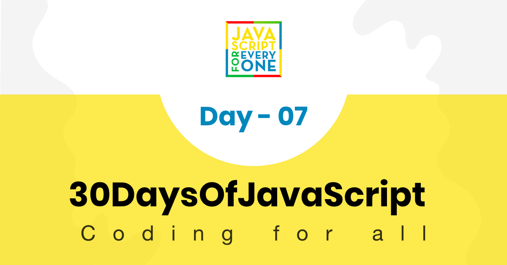


# 📔 День 6

## Петли

Большинство действий, которые мы выполняем в жизни, полны повторений. Представьте, если я попрошу вас вывести число от 0 до 100 с помощью console.log(). Для выполнения этой простой задачи вам может потребоваться от 2 до 5 минут. Такую утомительную и повторяющуюся задачу можно выполнить с помощью цикла. Если вы предпочитаете смотреть видео, вы можете ознакомиться с [видеоуроками] (https://www.youtube.com/channel/UCM4xOopkYiPwJqyKsSqL9mw).

В языках программирования для выполнения повторяющихся задач мы используем различные виды циклов. Ниже приведены примеры часто используемых циклов в JavaScript и других языках программирования.

### for Loop

```js
// Структура цикла For
for(initialization, condition, increment/decrement){
  // код здесь
}
```

```js
for(let i = 0; i <= 5; i++){
  console.log(i)
}

// 0 1 2 3 4 5
```

```js
for(let i = 5; i >= 0; i--){
  console.log(i)
}

// 5 4 3 2 1 0
```

```js
for(let i = 0; i <= 5; i++){
  console.log(`${i} * ${i} = ${i * i}`)
}
```

```sh
0 * 0 = 0
1 * 1 = 1
2 * 2 = 4
3 * 3 = 9
4 * 4 = 16
5 * 5 = 25
```

```js
const countries = ['Финляндия', 'Швеция', 'Дания', 'Норвегия', 'Исландия'].
const newArr = []
for(let i = 0; i < countries.length; i++){
  newArr.push(countries[i].toUpperCase())
}

// ["FINLAND", "SWEDEN", "DENMARK", "NORWAY", "ICELAND"].
```

Добавление всех элементов в массив

```js
const numbers = [1, 2, 3, 4, 5]
пусть сумма = 0
for(let i = 0; i < numbers.length; i++){
  sum = sum + numbers[i] // можно сократить, sum += numbers[i]

}

console.log(sum) // 15
```

Создание нового массива на основе существующего массива

```js
const numbers = [1, 2, 3, 4, 5]
const newArr = []
пусть сумма = 0
for(let i = 0; i < numbers.length; i++){
  newArr.push(i * i)

}

console.log(newArr) // [1, 4, 9, 16, 25]
```

```js
const countries = ['Финляндия', 'Швеция', 'Норвегия', 'Дания', 'Исландия'].
const newArr = []
for(let i = 0; i < countries.length; i++){
  newArr.push(countries[i].toUpperCase())
}

console.log(newArr) // ["FINLAND", "SWEDEN", "NORWAY", "DENMARK", "ICELAND"]
```

### цикл while

```js
пусть i = 0
while (i <= 5) {
  console.log(i)
  i++
}

// 0 1 2 3 4 5
```

### do while loop

```js
пусть i = 0
делать {
  console.log(i)
  i++
} while (i <= 5)

// 0 1 2 3 4 5
```

### для цикла

Мы используем цикл for для массивов. Это очень удобный способ итерации по массиву, если нас не интересует индекс каждого элемента в массиве.

```js
for (const element of arr) {
  // код здесь
}
```

```js

const numbers = [1, 2, 3, 4, 5]

for (const num of numbers) {
  console.log(num)
}

// 1 2 3 4 5

for (const num of numbers) {
  console.log(num * num)
}

// 1 4 9 16 25

// сложение всех чисел в массиве
пусть сумма = 0
for (const num of numbers) {
  sum += sum + num // можно также сократить следующим образом, sum += num
}
console.log(sum) // 15

const webTechs = [
  'HTML',
  'CSS',
  'JavaScript',
  'React',
  'Redux',
  'Node',
  'MongoDB'
]

for (const tech of webTechs) {
  console.log(tech.toUpperCase())
}

// HTML CSS JAVASCRIPT REACT NODE MONGODB

for (const tech of webTechs) {
  console.log(tech[0]) // получаем только первую букву каждого элемента, H C J R N M
}

```

```js
const countries = ['Финляндия', 'Швеция', 'Норвегия', 'Дания', 'Исландия'].
const newArr = []
for(const country of countries){
  newArr.push(country.toUpperCase())
}

console.log(newArr) // ["FINLAND", "SWEDEN", "NORWAY", "DENMARK", "ICELAND"]
```

### break

Break используется для прерывания цикла.

```js
for(let i = 0; i <= 5; i++){
  если (i == 3){
    перерыв
  }
  console.log(i)
}

// 0 1 2
```

Приведенный выше код останавливается, если в процессе итерации найдено 3.

### продолжить

Мы используем ключевое слово *continue*, чтобы пропустить определенную итерацию. 

```js
for(let i = 0; i <= 5; i++){
  если (i == 3){
    продолжить
  }
  console.log(i)
}

// 0 1 2 4 5
```

🌕 Вы такой смелый, что дошли до этого. Теперь вы получили возможность автоматизировать повторяющиеся и утомительные задачи. Вы только что завершили 6-й день испытаний, и теперь вы на 6 шагов впереди на пути к величию. Теперь сделайте несколько упражнений для мозга и для мышц.

## 💻 Упражнения: день 6

### Упражнения: Уровень 1

  ```js
  const страны = [
    'Албания',
    'Боливия',
    'Канада',
    'Дания',
    'Эфиопия',
    'Финляндия',
    'Германия',
    'Венгрия',
    'Ирландия',
    'Япония',
    'Кения'
  ]

  const webTechs = [
    'HTML',
    'CSS',
    'JavaScript',
    'React',
    'Redux',
    'Node',
    'MongoDB'
  ]

  const mernStack = ['MongoDB', 'Express', 'React', 'Node'].
  ```

1. Выполните итерацию от 0 до 10 с помощью цикла for, сделайте то же самое с помощью цикла while и do while
2. Выполните итерацию от 10 до 0 с помощью цикла for, сделайте то же самое с помощью цикла while и do while
3. Итерация от 0 до n с помощью цикла for
4. Напишите цикл, который выполняет следующий шаблон, используя console.log():

   ```js
       #
       ##
       ###
       ####
       #####
       ######
       #######
   ```

5. Используйте петлю для печати следующего узора:

   ```sh
   0 x 0 = 0
   1 x 1 = 1
   2 x 2 = 4
   3 x 3 = 9
   4 x 4 = 16
   5 x 5 = 25
   6 x 6 = 36
   7 x 7 = 49
   8 x 8 = 64
   9 x 9 = 81
   10 x 10 = 100
   ```

6. С помощью петли напечатайте следующий узор

   ```sh
    i i^2 i^3
    0 0 0
    1 1 1
    2 4 8
    3 9 27
    4 16 64
    5 25 125
    6 36 216
    7 49 343
    8 64 512
    9 81 729
    10 100 1000
   ```

7. Используйте цикл for для итерации от 0 до 100 и выведите только четные числа
8. Используйте цикл for для итерации от 0 до 100 и печати только нечетных чисел
9. Используйте цикл for для итерации от 0 до 100 и выведите только простые числа
10. Используйте цикл for для итерации от 0 до 100 и выведите сумму всех чисел.

    ```sh
    Сумма всех чисел от 0 до 100 равна 5050.
    ```

11. Используйте цикл for для итерации от 0 до 100 и выведите сумму всех четных и сумму всех нечетных.

    ```sh
    Сумма всех четных от 0 до 100 равна 2550. А сумма всех шансов от 0 до 100 равна 2500.
    ```

12. Используйте цикл for для итерации от 0 до 100 и выведите сумму всех четных и сумму всех нечетных значений. Выведите сумму четных и сумму нечетных в виде массива

    ```sh
      [2550, 2500]
    ```

13. Разработайте небольшой скрипт, генерирующий массив из 5 случайных чисел
14. Разработайте небольшой скрипт, который генерирует массив из 5 случайных чисел, причем числа должны быть уникальными
15. Разработайте небольшой скрипт, который генерирует случайный идентификатор из шести символов:

    ```sh
    5j2khz
    ```
  <div align="center">
  <h1>30 дней JavaScript: Функции</h1>
  <a class="header-badge" target="_blank" href="https://www.linkedin.com/in/asabeneh/">
  
  </a>
  <a class="header-badge" target="_blank" href="https://twitter.com/Asabeneh">
  .
  </a>

  <sub>Автор:
  <a href="https://www.linkedin.com/in/asabeneh/" target="_blank">Asabeneh Yetayeh</a><br>
  <small>январь, 2020</small>
  </sub>
</div>

[<< День 6](../06_Day_Loops/06_day_loops.md) | [День 8 >>](../08_Day_Objects/08_day_objects.md)



- [📔 День 7](#день-7)
  - [Функции](#functions)
    - [Декларация функций](#function-declaration)
    - [Функция без параметра и возврата](#function-without-a-parameter-and-return)
    - [Функция, возвращающая значение](#function-returning-value)
    - [Функция с параметром](#function-with-a-parameter)
    - [Функция с двумя параметрами](#function-with-two-parameters)
    - [Функция со многими параметрами](#function-with-many-parameters)
    - [Функция с неограниченным количеством параметров](#function-with-unlimited-number-of-parameters)
      - [Неограниченное количество параметров в регулярной функции](#unlimited-number-of-parameters-in-regular-function)
      - [Неограниченное количество параметров в стрелочной функции](#unlimited-number-of-parameters-in-arrow-function)
    - [Анонимная функция](#anonymous-function)
    - [Функция выражения](#expression-function)
    - [Self Invoking Functions](#self-invoking-functions)
    - [Функция стрелки](#arrow-function)
    - [Функция с параметрами по умолчанию](#function-with-default-parameters)
    - [Объявление функции против стрелочной функции](#function-declaration-versus-arrow-function)
  - [💻 Упражнения](#-exercises)
    - [Упражнения: уровень 1](#exercises-level-1)
    - [Упражнения: уровень 2](#exercises-level-2)
    - [Упражнения: уровень 3](#exercises-level-3)

# 📔 День 7

## Функции

До сих пор мы рассматривали множество встроенных функций JavaScript. В этом разделе мы сосредоточимся на пользовательских функциях. Что такое функция? Прежде чем мы начнем создавать функции, давайте разберемся, что такое функция и зачем она нам нужна?

Функция - это многократно используемый блок кода или программных утверждений, предназначенный для выполнения определенной задачи.
Функция объявляется ключевым словом функции, за которым следует имя, а затем круглые скобки (). Круглые скобки могут принимать параметр. Если функция принимает параметр, она будет вызвана с аргументом. Функция также может принимать параметр по умолчанию. Чтобы сохранить данные в функции, функция должна возвращать определенные типы данных. Чтобы получить значение, мы вызываем или вызываем функцию.
Функция создает код:

- чистый и легко читаемый
- многоразовый
- легко тестировать

Функция может быть объявлена или создана несколькими способами:

- _Декларативная функция_
- _Выразительная функция_
- _Анонимная функция_
- _Функция стрелки_.

### Декларация функций

Давайте посмотрим, как объявить функцию и как вызвать функцию.

```js
//объявление функции без параметра
function functionName() {
  // код здесь
}
functionName() // вызов функции по ее имени и со скобками
```

### Функция без параметра и возврата

Функция может быть объявлена без параметра.

**Пример:**

```js
// функция без параметра, функция, возводящая число в квадрат
функция square() {
  пусть num = 2
  пусть sq = num * num
  console.log(sq)
}

square() // 4

// функция без параметра
функция addTwoNumbers() {
  пусть numOne = 10
  пусть numTwo = 20
  пусть sum = numOne + numTwo

  console.log(sum)
}

addTwoNumbers() // для выполнения функция должна быть вызвана по ее имени 
```

```js
  функция printFullName (){
      let firstName = 'Asabeneh'
      Пусть LastName = 'Yetayeh'
      Пусть пробел = ' '
      let fullName = firstName + пробел + lastName
      console.log(fullName)
}

printFullName() // вызов функции
```

### Функция, возвращающая значение

Функция также может возвращать значения, если функция не возвращает значения, то значение функции не определено. Давайте напишем приведенные выше функции с возвратом. С этого момента мы возвращаем значение функции вместо того, чтобы выводить его на печать.

```js
функция printFullName (){
      let firstName = 'Asabeneh'
      Пусть LastName = 'Yetayeh'
      Пусть пробел = ' '
      let fullName = firstName + пробел + lastName
      return fullName
}
console.log(printFullName())
```

```js

  функция addTwoNumbers() {
      пусть numOne = 2
      пусть numTwo = 3
      пусть total = numOne + numTwo
      общий доход

  }

console.log(addTwoNumbers())
```

### Функция с параметром

В функции мы можем передавать в качестве параметра различные типы данных (число, строка, булеан, объект, функция).

```js
// функция с одним параметром
function functionName(parm1) {
  //код переходит к ней
}
functionName(parm1) // при вызове или вызове необходим один аргумент

функция areaOfCircle(r) {
  площадь = Math.PI * r * r
  зона возврата
}

console.log(areaOfCircle(10)) // должен вызываться с одним аргументом

function square(number) {
  вернуть номер * номер
}

console.log(square(10))
```

### Функция с двумя параметрами

```js
// функция с двумя параметрами
function functionName(parm1, parm2) {
  //код переходит к ней
}
functionName(parm1, parm2) // при вызове или обращении требуется два аргумента
// Функция без параметра не принимает входные данные, поэтому сделаем функцию с параметрами
функция sumTwoNumbers(numOne, numTwo) {
  пусть sum = numOne + numTwo
  console.log(sum)
}
sumTwoNumbers(10, 20) // вызов функций
// Если функция не возвращается, то она не хранит данные, поэтому она должна возвращаться

функция sumTwoNumbers(numOne, numTwo) {
  пусть sum = numOne + numTwo
  сумма возврата
}

console.log(sumTwoNumbers(10, 20))
функция printFullName(firstName, lastName) {
  return `${firstName} ${lastName}`
}
console.log(printFullName('Asabeneh', 'Yetayeh'))
```

### Функция со многими параметрами

```js
// функция с несколькими параметрами
function functionName(parm1, parm2, parm3,...){
  //код здесь
}
functionName(parm1,parm2,parm3,...) // при вызове или обращении необходимо три аргумента


// эта функция принимает массив в качестве параметра и суммирует числа в массиве
function sumArrayValues(arr) {
  пусть sum = 0;
  for (let i = 0; i < arr.length; i++) {
    sum = sum + arr[i];
  }
  вернуть сумму;
}
const numbers = [1, 2, 3, 4, 5];
    //вызов функции
console.log(sumArrayValues(numbers));


    const areaOfCircle = (radius) => {
      Пусть площадь = Math.PI * радиус * радиус;
      зона возврата;
    }
console.log(areaOfCircle(10))

```

### Функция с неограниченным количеством параметров

Иногда мы не знаем, сколько аргументов собирается передать пользователь. Поэтому мы должны знать, как написать функцию, которая может принимать неограниченное количество аргументов. В том, как мы это делаем, есть существенная разница между объявлением функции (обычной функцией) и стрелочной функцией. Давайте рассмотрим примеры как объявления функции, так и стрелочной функции.

#### Неограниченное количество параметров в регулярной функции

 Объявление функции предоставляет массив аргументов, подобный объекту. Все, что мы передали в качестве аргумента в функции, может быть доступно из объекта arguments внутри функций. Давайте посмотрим пример

 ```js
// Давайте обратимся к объекту аргументов

функция sumAllNums() {
  console.log(arguments)
}

sumAllNums(1, 2, 3, 4)) 
// Arguments(4) [1, 2, 3, 4, callee: ƒ, Symbol(Symbol.iterator): ƒ]

```

```js
// объявление функции

функция sumAllNums() {
  пусть сумма = 0
  for (let i = 0; i < arguments.length; i++) {
    sum += arguments[i]
  }
  сумма возврата
}

console.log(sumAllNums(1, 2, 3, 4)) // 10
console.log(sumAllNums(10, 20, 13, 40, 10)) // 93
console.log(sumAllNums(15, 20, 30, 25, 10, 33, 40)) // 173
```

#### Неограниченное количество параметров в функции стрелки

 Функция Arrow не имеет объекта аргументов, привязанного к функции. Для реализации функции, принимающей неограниченное количество аргументов, в стрелочной функции мы используем оператор spread, за которым следует любое имя параметра.  Все, что мы передали в качестве аргумента в функции, может быть доступно как массив в стрелочной функции. Рассмотрим пример

 ```js
// Давайте обратимся к объекту аргументов

const sumAllNums = (...args) => {
  // console.log(arguments), объект arguments не найден в функции arrow
  // вместо этого мы используем параметр a, за которым следует оператор spread
  console.log(args)
}

sumAllNums(1, 2, 3, 4))
// [1, 2, 3, 4]

```

```js
// объявление функции

const sumAllNums = (...args) => {
  пусть сумма = 0
  for (const element of args) {
    сумма += элемент
  }
  сумма возврата
}

console.log(sumAllNums(1, 2, 3, 4)) // 10
console.log(sumAllNums(10, 20, 13, 40, 10)) // 93
console.log(sumAllNums(15, 20, 30, 25, 10, 33, 40)) // 173
```

### Анонимная функция

Анонимная функция или без имени

```js
const anonymousFun = function() {
  console.log(
    'Я анонимная функция, и мое значение хранится в anonymousFun'
  )
}
```

### Функция выражения

Функции выражения являются анонимными функциями. Создав функцию без имени, мы присваиваем ее переменной. Чтобы вернуть значение из функции, мы должны вызвать переменную. Посмотрите на пример ниже.

```js

// Функциональное выражение
const square = function(n) {
  вернуть n * n
}

console.log(square(2)) // -> 4
```

### Self Invoking Functions

Самовызывающиеся функции - это анонимные функции, которые не нужно вызывать, чтобы вернуть значение.

```js
(function(n) {
  console.log(n * n)
})(2) // 4, но вместо того, чтобы просто печатать, если мы хотим вернуть и сохранить данные, мы делаем так, как показано ниже

let squaredNum = (function(n) {
  вернуть n * n
})(10)

console.log(squaredNum)
```

### Функция стрелки

Стрелочная функция является альтернативой написанию функции, однако объявление функции и стрелочная функция имеют некоторые незначительные различия.

Стрелочная функция использует стрелку вместо ключевого слова *function* для объявления функции. Рассмотрим объявление функции и стрелочную функцию.

```js
// Так мы пишем обычную функцию или функцию объявления
// Давайте изменим эту функцию объявления на функцию стрелки
функция square(n) {
  вернуть n * n
}

console.log(square(2)) // 4

const square = n => {
  вернуть n * n
}

console.log(square(2))  // -> 4

// если у нас только одна строка в блоке кода, то ее можно записать следующим образом, явный return
const square = n => n * n // -> 4
```

```js
const changeToUpperCase = arr => {
  const newArr = []
  for (const element of arr) {
    newArr.push(element.toUpperCase())
  }
  return newArr
}

const countries = ['Финляндия', 'Швеция', 'Норвегия', 'Дания', 'Исландия'].
console.log(changeToUpperCase(countries))

// ["FINLAND", "SWEDEN", "NORWAY", "DENMARK", "ICELAND"].
```

```js
const printFullName = (firstName, lastName) => {
  return `${firstName} ${lastName}`
}

console.log(printFullName('Asabeneh', 'Yetayeh'))
```

Приведенная выше функция имеет только оператор return, поэтому мы можем явно вернуть ее следующим образом.

```js
const printFullName = (firstName, lastName) => `${firstName} ${lastName}`.

console.log(printFullName('Asabeneh', 'Yetayeh'))
```

### Функция с параметрами по умолчанию

Иногда мы передаем параметрам значения по умолчанию, при вызове функции, если мы не передали аргумент, будет использовано значение по умолчанию. Как объявление функции, так и стрелочная функция могут иметь значение или значения по умолчанию.

```js
// синтаксис
// Объявление функции
function functionName(param = value) {
  //codes
}

// Вызывающая функция
functionName()
functionName(arg)
```

**Пример:**

```js
function greetings(name = 'Peter') {
  let message = `${имя}, добро пожаловать на 30 Days Of JavaScript!
  обратное сообщение
}

console.log(greetings())
console.log(greetings('Asabeneh'))
```

```js
function generateFullName(firstName = 'Asabeneh', lastName = 'Yetayeh') {
  Пусть пробел = ' '
  let fullName = firstName + пробел + lastName
  return fullName
}

console.log(generateFullName())
console.log(generateFullName('David', 'Smith'))
```

```js
function calculateAge(birthYear, currentYear = 2019) {
  пусть возраст = текущий год - год рождения
  возраст возврата
}

console.log('Возраст: ', calculateAge(1819))
```

```js
function weightOfObject(mass, gravity = 9.81) {
  let weight = mass * gravity + ' N' // сначала значение должно быть изменено на строку
  возвращаемый вес
}

console.log('Вес объекта в Ньютонах: ', weightOfObject(100)) // 9,81 сила тяжести на поверхности Земли
console.log('Вес объекта в Ньютонах: ', weightOfObject(100, 1.62)) // сила тяжести на поверхности Луны
```

Давайте посмотрим, как мы запишем вышеуказанные функции с помощью стрелочных функций

```js
// синтаксис
// Объявление функции
const functionName = (param = value) => {
  //codes
}

// Вызывающая функция
functionName()
functionName(arg)
```

**Пример:**

```js
const greetings = (name = 'Peter') => {
  let message = name + ', добро пожаловать в 30 Days Of JavaScript!'
  обратное сообщение
}

console.log(greetings())
console.log(greetings('Asabeneh'))
```

```js
const generateFullName = (firstName = 'Asabeneh', lastName = 'Yetayeh') => {
  Пусть пробел = ' '
  let fullName = firstName + пробел + lastName
  return fullName
}

console.log(generateFullName())
console.log(generateFullName('David', 'Smith'))
```

```js

const calculateAge = (birthYear, currentYear = 2019) => currentYear - birthYear
console.log('Возраст: ', calculateAge(1819))
```

```js
const weightOfObject = (масса, гравитация = 9.81) => масса * гравитация + ' N'
  
console.log('Вес объекта в Ньютонах: ', weightOfObject(100)) // 9,81 сила тяжести на поверхности Земли
console.log('Вес объекта в Ньютонах: ', weightOfObject(100, 1.62)) // сила тяжести на поверхности Луны
```

### Объявление функции против функции-стрелки

Об этом будет рассказано в другой раз.

🌕 Вы - восходящая звезда, теперь вы знаете функции. Теперь вы заряжены силой функций. Вы только что завершили 7-й день испытаний и вы на 7 шагов впереди на пути к величию. Теперь сделайте несколько упражнений для вашего мозга и для ваших мышц.

## 💻 Упражнения

### Упражнения: Уровень 1

1. Объявите функцию _fullName_, и она выведет ваше полное имя.
2. Объявите функцию _fullName_ и теперь она принимает в качестве параметра firstName, lastName и возвращает ваше полное имя.
3. Объявите функцию _addNumbers_, которая принимает два параметра и возвращает сумму.
4. Площадь прямоугольника вычисляется следующим образом: _площадь = длина x ширина_. Напишите функцию, которая вычисляет _areaOfRectangle_.
5. Периметр прямоугольника вычисляется следующим образом: _периметр= 2x(длина + ширина)_. Напишите функцию, которая вычисляет _периметр_прямоугольника.
6. Объем прямоугольной призмы вычисляется следующим образом: _объем = длина х ширина х высота_. Напишите функцию, которая вычисляет _объем_прямоугольной_призмы.
7. Площадь круга вычисляется следующим образом: _площадь = π x r x r_. Напишите функцию, которая вычисляет _areaOfCircle_.
8. Окружность круга вычисляется следующим образом: _circumference = 2πr_. Напишите функцию, которая вычисляет _окружность_.
9. Плотность вещества вычисляется следующим образом:_плотность=масса/объем_. Напишите функцию, которая вычисляет _плотность_.
10. Скорость рассчитывается путем деления общего расстояния, пройденного движущимся объектом, на общее количество затраченного времени. Напишите функцию, которая вычисляет скорость движущегося объекта, _speed_.
11. Вес вещества рассчитывается следующим образом: _вес = масса х гравитация_. Напишите функцию, которая вычисляет _вес_.
12. Температура в oC может быть переведена в oF по следующей формуле: _oF = (oC x 9/5) + 32_. Напишите функцию, которая переводит oC в oF _convertCelciusToFahrenheit_.
13. Индекс массы тела (ИМТ) рассчитывается следующим образом: _bmi = вес в кг / (рост х рост) в м2_. Напишите функцию, которая вычисляет _bmi_. Индекс массы тела используется для широкого определения различных групп веса у взрослых людей в возрасте 20 лет и старше. Проверьте, есть ли у человека _недостаточный вес, нормальный, избыточный вес_ или _ожирение_ на основе приведенной ниже информации.

    - Одни и те же группы относятся как к мужчинам, так и к женщинам.
    - _Недостаточный вес_: ИМТ менее 18,5
    - _Нормальный вес_: ИМТ от 18,5 до 24,9
    - Избыточный вес: ИМТ от 25 до 29,9
    - _Обез_: ИМТ 30 и более

14. Напишите функцию _checkSeason_, она принимает параметр месяц и возвращает сезон: осень, зима, весна или лето.
15. Math.max возвращает наибольший аргумент. Напишите функцию findMax, которая принимает три аргумента и возвращает их максимум без использования метода Math.max.

    ```js
    console.log(findMax(0, 10, 5))
    10
    console.log(findMax(0, -10, -2))
    0
    ```
  
### Упражнения: Уровень 2

1. Линейное уравнение вычисляется следующим образом: _ax + by + c = 0_. Напишите функцию, которая вычисляет значение линейного уравнения, _solveLinEquation_.
1. Квадратное уравнение вычисляется следующим образом: _ax2 + bx + c = 0_. Напишите функцию, которая вычисляет значение или значения квадратного уравнения, _solveQuadEquation_.

    ```js
    console.log(solveQuadratic()) // {0}
    console.log(solveQuadratic(1, 4, 4)) // {-2}
    console.log(solveQuadratic(1, -1, -2)) // {2, -1}
    console.log(solveQuadratic(1, 7, 12)) // {-3, -4}
    console.log(solveQuadratic(1, 0, -4)) //{2, -2}
    console.log(solveQuadratic(1, -1, 0)) //{1, 0}
    ```

1. Объявите функцию с именем _printArray_. Она принимает массив в качестве параметра и распечатывает каждое значение массива.
1. Напишите функцию с именем _showDateTime_, которая показывает время в таком формате: 08/01/2020 04:08, используя объект Date.

    ```sh
    showDateTime()
    08/01/2020 04:08
    ```

1. Объявите функцию с именем _swapValues_. Эта функция меняет значение x на y.

    ```js
    swapValues(3, 4) // x => 4, y=>3
    swapValues(4, 5) // x = 5, y = 4
    ```

1. Объявите функцию с именем _reverseArray_. Она принимает массив в качестве параметра и возвращает обратную часть массива (не используйте метод).

    ```js
    console.log(reverseArray([1, 2, 3, 4, 5]))
    //[5, 4, 3, 2, 1]
    console.log(reverseArray(['A', 'B', 'C']))
    //['C', 'B', 'A'].
    ```

1. Объявите функцию с именем _capitalizeArray_. Она принимает массив в качестве параметра и возвращает капитализированный массив.
1. Объявите функцию с именем _addItem_. Она принимает параметр элемента и возвращает массив после добавления элемента
1. Объявите функцию с именем _removeItem_. Она принимает параметр index и возвращает массив после удаления элемента
1. Объявите функцию с именем _sumOfNumbers_. Она принимает параметр числа и складывает все числа в этом диапазоне.
1. Объявите функцию с именем _sumOfOdds_. Она принимает параметр числа и складывает все нечетные числа в этом диапазоне.
1. Объявите функцию с именем _sumOfEven_. Она принимает параметр числа и складывает все четные числа в этом диапазоне.
1. Объявите функцию с именем evensAndOdds . Она принимает в качестве параметра целое положительное число и подсчитывает количество четных и нечетных значений в числе.

    ```sh
    evensAndOdds(100);
    Количество коэффициентов равно 50.
    Количество четных - 51.
    ```

1. Напишите функцию, которая принимает любое количество аргументов и возвращает сумму аргументов

    ```js
    sum(1, 2, 3) // -> 6
    sum(1, 2, 3, 4) // -> 10
    ```

1. Напишите функцию, которая генерирует _randomUserIp_.
1. Напишите функцию, которая генерирует _случайный_мак-адрес_.
1. Объявите функцию с именем _randomHexaNumberGenerator_. При вызове этой функции она генерирует случайное шестнадцатеричное число. Функция возвращает шестнадцатеричное число.

    ```sh
    console.log(randomHexaNumberGenerator());
    '#ee33df'
    ```

1. Объявите функцию с именем _userIdGenerator_. Когда эта функция вызывается, она генерирует семисимвольный идентификатор. Функция возвращает идентификатор.

    ```sh
    console.log(userIdGenerator());
    41XTDbE
    ```

### Упражнения: Уровень 3

1. Измените номер вопроса n . Объявите функцию с именем _userIdGeneratedByUser_. Она не принимает никаких параметров, но принимает два входных сигнала с помощью функции prompt(). Один из них - это количество символов, а второй - количество идентификаторов, которые должны быть сгенерированы.

    ```sh
    userIdGeneratedByUser()
    'kcsy2
    SMFYb
    bWmeq
    ZXOYh
    2Rgxf
    '
    userIdGeneratedByUser()
    '1GCSgPLMaBAVQZ26
    YD7eFwNQKNs7qXaT
    ycArC5yrRupyG00S
    UbGxOFI7UXSWAyKN
    dIV0SSUTgAdKwStr
    '
    ```

1. Напишите функцию с именем _rgbColorGenerator_, которая генерирует цвета rgb.

    ```sh
    rgbColorGenerator()
    rgb(125,244,255)
    ```

1. Напишите функцию **_arrayOfHexaColors_**, которая возвращает любое количество шестнадцатеричных цветов в массиве.
1. Напишите функцию **_arrayOfRgbColors_**, которая возвращает любое количество цветов RGB в массиве.
1. Напишите функцию **_convertHexaToRgb_**, которая преобразует цвет hexa в rgb и возвращает цвет rgb.
1. Напишите функцию **_convertRgbToHexa_**, которая преобразует цвет rgb в цвет hexa и возвращает цвет hexa.
1. Напишите функцию **_generateColors_**, которая может генерировать любое количество цветов hexa или rgb.

    ```js
    console.log(generateColors('hexa', 3)) // ['#a3e12f', '#03ed55', '#eb3d2b']
    console.log(generateColors('hexa', 1)) // '#b334ef'
    console.log(generateColors('rgb', 3)) // ['rgb(5, 55, 175)', 'rgb(50, 105, 100)', 'rgb(15, 26, 80)'].
    console.log(generateColors('rgb', 1)) // 'rgb(33,79, 176)'
    ```

1. Вызовите вашу функцию _shuffleArray_, она принимает массив в качестве параметра и возвращает перетасованный массив
1. Назовите вашу функцию _факториал_, она принимает в качестве параметра целое число и возвращает факториал числа
1. Вызовите свою функцию _isEmpty_, она принимает параметр и проверяет, пуст он или нет.
1. Назовите вашу функцию _sum_, она принимает любое количество аргументов и возвращает сумму.
1. Напишите функцию _sumOfArrayItems_, которая принимает параметр массива и возвращает сумму всех элементов. Проверьте, все ли элементы массива являются числовыми типами. Если нет, верните разумный отзыв.
1. Напишите функцию _average_, которая принимает параметр массива и возвращает среднее значение элементов. Проверьте, все ли элементы массива являются числовыми типами. Если нет, верните разумный отзыв.
1. Напишите функцию _modifyArray_, которая принимает массив в качестве параметра, изменяет пятый элемент массива и возвращает массив. Если длина массива меньше пяти, возвращается сообщение 'элемент не найден'.

    ```js
    console.log(modifyArray(['Avocado', 'Tomato', 'Potato', 'Mango', 'Lemon', 'Carrot']);
    ```

    ```sh
    ['Avocado', 'Tomato', 'Potato', 'Mango', 'LEMON', 'Carrot'].
    ```

    ```js
    console.log(modifyArray(['Google', 'Facebook', 'Apple', 'Amazon', 'Microsoft', 'IBM']);
    ```

    ```sh
    ['Google', 'Facebook', 'Apple', 'Amazon', 'MICROSOFT', 'IBM'].
    ```

    ```js
    console.log(modifyArray(['Google', 'Facebook', 'Apple', 'Amazon']);
    ```

    ```sh
      'Not Found'
    ```

1. Напишите функцию _isPrime_, которая проверяет, является ли число простым.
1. Напишите функцию, которая проверяет, все ли элементы в массиве уникальны.
1. Напишите функцию, которая проверяет, все ли элементы массива имеют одинаковый тип данных.
1. Имя переменной JavaScript не поддерживает специальные символы или знаки, кроме \$ или \_. Напишите функцию **isValidVariable**, которая проверяет, является ли переменная допустимой или недопустимой.
1. Напишите функцию, которая возвращает массив из семи случайных чисел в диапазоне 0-9. Все числа должны быть уникальными.

    ```js
    sevenRandomNumbers()
    [(1, 4, 5, 7, 9, 8, 0)]
    ```

1. Напишите функцию reverseCountries, которая принимает массив стран, сначала копирует массив и возвращает обратный исходному массив.
