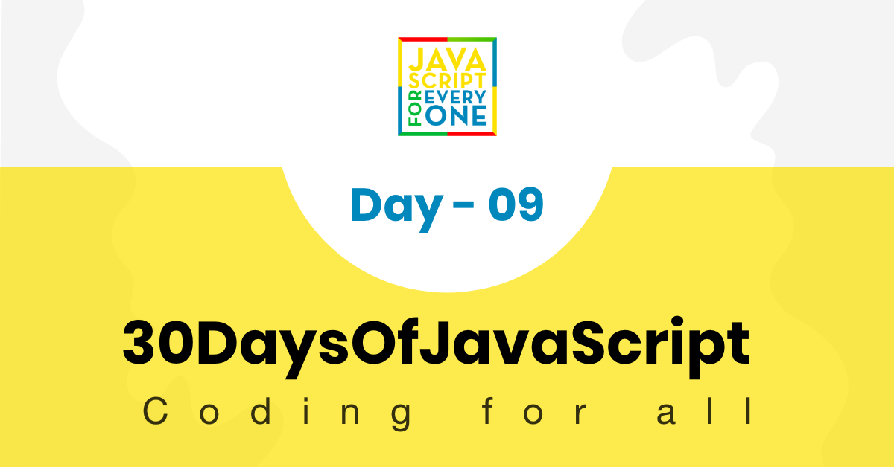

# 📔 Day 8

## Scope

Variable is the fundamental part in programming. We declare variable to store different data types. To declare a variable we use the key word _var_, _let_ and _const_. A variable can declared at different scope. In this section we will see the scope, scope of variables when we use var or let.
Variables scopes can be:

- Window
- Global
- Local

Variable can be declared globally or locally or window scope. We will see both global and local scope.
Anything declared without let, var or const is scoped at window level.

Let us image we have a scope.js file.

### Window Scope

Without using console.log() open your browser and check, you will see the value of a and b if you write a or b on the browser. That means a and b are already available in the window.

```js
//scope.js
a = 'JavaScript' // is a window scope this found anywhere
b = 10 // this is a window scope variable
function letsLearnScope() {
  console.log(a, b)
  if (true) {
    console.log(a, b)
  }
}
console.log(a, b) // accessible
```

### Global scope

A globally declared variable can be accessed every where in the same file. But the term global is relative. It can be global to the file or it can be global relative to some block of codes.

```js
//scope.js
let a = 'JavaScript' // is a global scope it will be found anywhere in this file
let b = 10 // is a global scope it will be found anywhere in this file
function letsLearnScope() {
  console.log(a, b) // JavaScript 10, accessible
  if (true) {
    let a = 'Python'
    let b = 100
    console.log(a, b) // Python 100
  }
  console.log(a, b)
}
letsLearnScope()
console.log(a, b) // JavaScript 10, accessible
```

### Local scope

A variable declared as local can be accessed only in certain block code.

```js
//scope.js
let a = 'JavaScript' // is a global scope it will be found anywhere in this file
let b = 10 // is a global scope it will be found anywhere in this file
function letsLearnScope() {
  console.log(a, b) // JavaScript 10, accessible
  let c = 30
  if (true) {
    // we can access from the function and outside the function but 
    // variables declared inside the if will not be accessed outside the if block
    let a = 'Python'
    let b = 20
    let d = 40
    console.log(a, b, c) // Python 20 30
  }
  // we can not access c because c's scope is only the if block
  console.log(a, b) // JavaScript 10
}
letsLearnScope()
console.log(a, b) // JavaScript 10, accessible
```

Now, you have an understanding of scope. A variable declared with *var* only scoped to function but variable declared with *let* or *const* is block scope(function block, if block, loop etc). Block in JavaScript is a code in between two curly brackets ({}).

```js
//scope.js
function letsLearnScope() {
  var gravity = 9.81
  console.log(gravity)

}
// console.log(gravity), Uncaught ReferenceError: gravity is not defined

if (true){
  var gravity = 9.81
  console.log(gravity) // 9.81
}
console.log(gravity)  // 9.81

for(var i = 0; i < 3; i++){
  console.log(i) // 1, 2, 3
}
console.log(i)

```

In ES6 and above there is *let* and *const*, so you will not suffer from the sneakiness of *var*. When we use *let* our variable is block scoped and it will not infect other parts of our code.

```js
//scope.js
function letsLearnScope() {
  // you can use let or const, but gravity is constant I prefer to use const
  const gravity = 9.81
  console.log(gravity)

}
// console.log(gravity), Uncaught ReferenceError: gravity is not defined

if (true){
  const  gravity = 9.81
  console.log(gravity) // 9.81
}
// console.log(gravity), Uncaught ReferenceError: gravity is not defined

for(let i = 0; i < 3; i++){
  console.log(i) // 1, 2, 3
}
// console.log(i), Uncaught ReferenceError: gravity is not defined

```

The scope *let* and *const* is the same. The difference is only reassigning. We can not change or reassign the value of const variable. I would strongly suggest you to use *let* and *const*, by using *let* and *const* you will writ clean code and avoid hard to debug mistakes. As a rule of thumb, you can use *let* for any value which change, *const* for any constant value, and for array, object, arrow function and function expression.

## 📔 Object

Everything can be an object and objects do have properties and properties have values, so an object is a key value pair. The order of the key is not reserved, or there is no order.
To create an object literal, we use two curly brackets.

### Creating an empty object

An empty object

```js
const person = {}
```

### Creating an objecting with values

Now, the person object has firstName, lastName, age, location, skills and isMarried properties. The value of properties or keys could be a string, number, boolean, an object, null, undefined or a function.

Let us see some examples of object. Each key has a value in the object.

```js
const rectangle = {
  length: 20,
  width: 20
}
console.log(rectangle) // {length: 20, width: 20}

const person = {
  firstName: 'Asabeneh',
  lastName: 'Yetayeh',
  age: 250,
  country: 'Finland',
  city: 'Helsinki',
  skills: [
    'HTML',
    'CSS',
    'JavaScript',
    'React',
    'Node',
    'MongoDB',
    'Python',
    'D3.js'
  ],
  isMarried: true
}
console.log(person)
```

### Getting values from an object

We can access values of object using two methods:

- using . followed by key name if the key-name is a one word
- using square bracket and a quote

```js
const person = {
  firstName: 'Asabeneh',
  lastName: 'Yetayeh',
  age: 250,
  country: 'Finland',
  city: 'Helsinki',
  skills: [
    'HTML',
    'CSS',
    'JavaScript',
    'React',
    'Node',
    'MongoDB',
    'Python',
    'D3.js'
  ],
  getFullName: function() {
    return `${this.firstName}${this.lastName}`
  },
  'phone number': '+3584545454545'
}

// accessing values using .
console.log(person.firstName)
console.log(person.lastName)
console.log(person.age)
console.log(person.location)

// value can be accessed using square bracket and key name
console.log(person['firstName'])
console.log(person['lastName'])
console.log(person['age'])
console.log(person['age'])
console.log(person['location'])

// for instance to access the phone number we only use the square bracket method
console.log(person['phone number'])
```

### Creating object methods

Now, the person object has getFullName properties. The getFullName is function inside the person object and we call it an object method. The _this_ key word refers to the object itself. We can use the word _this_ to access the values of different properties of the object. We can not use an arrow function as object method because the word this refers to the window inside an arrow function instead of the object itself. Example of object:

```js
const person = {
  firstName: 'Asabeneh',
  lastName: 'Yetayeh',
  age: 250,
  country: 'Finland',
  city: 'Helsinki',
  skills: [
    'HTML',
    'CSS',
    'JavaScript',
    'React',
    'Node',
    'MongoDB',
    'Python',
    'D3.js'
  ],
  getFullName: function() {
    return `${this.firstName} ${this.lastName}`
  }
}

console.log(person.getFullName())
// Asabeneh Yetayeh
```

### Setting new key for an object

An object is a mutable data structure and we can modify the content of an object after it gets created.

Setting a new keys in an object

```js
const person = {
  firstName: 'Asabeneh',
  lastName: 'Yetayeh',
  age: 250,
  country: 'Finland',
  city: 'Helsinki',
  skills: [
    'HTML',
    'CSS',
    'JavaScript',
    'React',
    'Node',
    'MongoDB',
    'Python',
    'D3.js'
  ],
  getFullName: function() {
    return `${this.firstName} ${this.lastName}`
  }
}
person.nationality = 'Ethiopian'
person.country = 'Finland'
person.title = 'teacher'
person.skills.push('Meteor')
person.skills.push('SasS')
person.isMarried = true

person.getPersonInfo = function() {
  let skillsWithoutLastSkill = this.skills
    .splice(0, this.skills.length - 1)
    .join(', ')
  let lastSkill = this.skills.splice(this.skills.length - 1)[0]

  let skills = `${skillsWithoutLastSkill}, and ${lastSkill}`
  let fullName = this.getFullName()
  let statement = `${fullName} is a ${this.title}.\nHe lives in ${this.country}.\nHe teaches ${skills}.`
  return statement
}
console.log(person)
console.log(person.getPersonInfo())
```

```sh
Asabeneh Yetayeh is a teacher.
He lives in Finland.
He teaches HTML, CSS, JavaScript, React, Node, MongoDB, Python, D3.js, Meteor, and SasS.
```

### Object Methods

There are different methods to manipulate an object. Let us see some of the available methods.

_Object.assign_: To copy an object without modifying the original object

```js
const person = {
  firstName: 'Asabeneh',
  age: 250,
  country: 'Finland',
  city:'Helsinki',
  skills: ['HTML', 'CSS', 'JS'],
  title: 'teacher',
  address: {
    street: 'Heitamienkatu 16',
    pobox: 2002,
    city: 'Helsinki'
  },
  getPersonInfo: function() {
    return `I am ${this.firstName} and I live in ${this.city}, ${this.country}. I am ${this.age}.`
  }
}

//Object methods: Object.assign, Object.keys, Object.values, Object.entries
//hasOwnProperty

const copyPerson = Object.assign({}, person)
console.log(copyPerson)
```

#### Getting object keys using Object.keys()

_Object.keys_: To get the keys or properties of an object as an array

```js
const keys = Object.keys(copyPerson)
console.log(keys) //['name', 'age', 'country', 'skills', 'address', 'getPersonInfo']
const address = Object.keys(copyPerson.address)
console.log(address) //['street', 'pobox', 'city']
```

#### Getting object values using Object.values()

_Object.values_:To get values of an object as an array

```js
const values = Object.values(copyPerson)
console.log(values)
```

#### Getting object keys and values using Object.entries()

_Object.entries_:To get the keys and values in an array

```js
const entries = Object.entries(copyPerson)
console.log(entries)
```

#### Checking properties using hasOwnProperty()

_hasOwnProperty_: To check if a specific key or property exist in an object

```js
console.log(copyPerson.hasOwnProperty('name'))
console.log(copyPerson.hasOwnProperty('score'))
```

🌕 You are astonishing. Now, you are super charged with the power of objects. You have just completed day 8 challenges and you are 8 steps a head in to your way to greatness. Now do some exercises for your brain and for your muscle.

## 💻 Exercises

### Exercises: Level 1

1. Create an empty object called dog
1. Print the the dog object on the console
1. Add name, legs, color, age and bark properties for the dog object. The bark property is a method which return _woof woof_
1. Get name, legs, color, age and bark value from the dog object
1. Set new properties the dog object: breed, getDogInfo

 <div align="center">
  <h1> 30 Days Of JavaScript: Higher Order Functions</h1>
  <a class="header-badge" target="_blank" href="https://www.linkedin.com/in/asabeneh/">
  
  </a>
  <a class="header-badge" target="_blank" href="https://twitter.com/Asabeneh">
  
  </a>

<sub>Author:
<a href="https://www.linkedin.com/in/asabeneh/" target="_blank">Asabeneh Yetayeh</a><br>
<small> January, 2020</small>
</sub>

</div>

[<< Day 8](../08_Day_Objects/08_day_objects.md) | [Day 10 >>](../10_Day_Sets_and_Maps/10_day_Sets_and_Maps.md)



- [Day 9](#day-9)
  - [Higher Order Function](#higher-order-function)
    - [Callback](#callback)
    - [Returning function](#returning-function)
    - [setting time](#setting-time)
      - [setInterval](#setinterval)
      - [setTimeout](#settimeout)
  - [Functional Programming](#functional-programming)
    - [forEach](#foreach)
    - [map](#map)
    - [filter](#filter)
    - [reduce](#reduce)
    - [every](#every)
    - [find](#find)
    - [findIndex](#findindex)
    - [some](#some)
    - [sort](#sort)
      - [Sorting string values](#sorting-string-values)
      - [Sorting Numeric values](#sorting-numeric-values)
      - [Sorting Object Arrays](#sorting-object-arrays)
  - [💻 Exercises](#-exercises)
    - [Exercises: Level 1](#exercises-level-1)
    - [Exercises: Level 2](#exercises-level-2)
    - [Exercises: Level 3](#exercises-level-3)

# Day 9

## Higher Order Function

Higher order functions are functions which take other function as a parameter or return a function as a value. The function passed as a parameter is called callback.

### Callback

A callback is a function which can be passed as parameter to other function. See the example below.

```js
// a callback function, the function could be any name
const callback = (n) => {
  return n ** 2
}
​
// function take other function as a callback
function cube(callback, n) {
  return callback(n) * n
}
​
console.log(cube(callback, 3))
```

### Returning function

Higher order functions return function as a value
​

```js
// Higher order function returning an other function
const higherOrder = n => {
  const doSomething = m => {
    const doWhatEver = t => {
      return 2 * n + 3 * m + t
    }
    return doWhatEver
  }
​
  return doSomething
}
console.log(higherOrder(2)(3)(10))
```

Let us see were we use call back functions.For instance the _forEach_ method uses call back.

```js
const numbers = [1, 2, 3, 4]
​
const sumArray = arr => {
  let sum = 0
  const callBack = function(element) {
    sum += element
  }
  numbers.forEach(callback)
  return sum

}
console.log(sumArray(numbers))
```

```sh
15
```

The above example can be simplified as follows:

```js
const numbers = [1, 2, 3, 4]
​
const sumArray = arr => {
  let sum = 0
  numbers.forEach(function(element) {
    sum += element
  })
  return sum

}
console.log(sumArray(numbers))
```

```sh
15
```

### setting time

In JavaScript we can execute some activity on certain interval of time or we can schedule(wait) for sometime to execute some activities.

- setInterval
- setTimeout

#### setInterval

In JavaScript, we use setInterval higher order function to do some activity continuously with in some interval of time. The setInterval global method take a callback function and a duration as a parameter. The duration is in milliseconds and the callback will be always called in that interval of time.

```js
// syntax
function callBack() {
  // code goes here
}
setInterval(callback, duration)
```

```js
function sayHello() {
  console.log('Hello')
}
setInterval(sayHello, 2000) // it prints hello in every 2 seconds
```

#### setTimeout

In JavaScript, we use setTimeout higher order function to execute some action at some time in the future. The setTimeout global method take a callback function and a duration as a parameter. The duration is in milliseconds and the callback wait for that amount of time.

```js
// syntax
function callback() {
  // code goes here
}
setTimeout(callback, duration) // duration in milliseconds
```

```js
function sayHello() {
  console.log('Hello')
}
setTimeout(sayHello, 2000) // it prints hello after it waits for 2 seconds.
```

## Functional Programming

Instead of writing regular loop, latest version of JavaScript introduced lots of built in methods which can help us to solve complicated problems. All builtin methods take callback function. In this section, we will see _forEach_, _map_, _filter_, _reduce_, _find_, _every_, _some_, and _sort_.

### forEach

_forEach_: Iterate an array elements. We use _forEach_ only with arrays. It takes a callback function with elements, index parameter and array itself. The index and the array optional.

```js
arr.forEach(function (element, index, arr) {
  console.log(index, element, arr)
})
// The above code can be written using arrow function
arr.forEach((element, index, arr) => {
  console.log(index, element, arr)
})
// The above code can be written using arrow function and explicit return
arr.forEach((element, index, arr) => console.log(index, element, arr))
```

```js
let sum = 0;
const numbers = [1,2,3,4,5];
numbers.forEach(num => console.log(num)))

console.log(sum)
```

```sh
1
2
3
4
5
```

```js
let sum = 0;
const numbers = [1,2,3,4,5];
numbers.forEach(num => sum += num))

console.log(sum)
```

```sh
15
```

```js
const countries = ['Finland', 'Denmark', 'Sweden', 'Norway', 'Iceland']
countries.forEach((element) => console.log(element.toUpperCase()))
```

```sh
FINLAND
DENMARK
SWEDEN
NORWAY
ICELAND
```

### map

_map_: Iterate an array elements and modify the array elements. It takes a callback function with elements,  index , array parameter and return a new array.

```js
const modifiedArray = arr.map(function (element, index, arr) {
  return element
})
```

```js
/*Arrow function and explicit return
const modifiedArray = arr.map((element,index) => element);
*/
//Example
const numbers = [1, 2, 3, 4, 5]
const numbersSquare = numbers.map((num) => num * num)

console.log(numbersSquare)
```

```sh
[1, 4, 9, 16, 25]
```

```js
const names = ['Asabeneh', 'Mathias', 'Elias', 'Brook']
const namesToUpperCase = names.map((name) => name.toUpperCase())
console.log(namesToUpperCase)
```

```sh
['ASABENEH', 'MATHIAS', 'ELIAS', 'BROOK']
```

```js
const countries = [
  'Albania',
  'Bolivia',
  'Canada',
  'Denmark',
  'Ethiopia',
  'Finland',
  'Germany',
  'Hungary',
  'Ireland',
  'Japan',
  'Kenya',
]
const countriesToUpperCase = countries.map((country) => country.toUpperCase())
console.log(countriesToUpperCase)

/*
// Arrow function
const countriesToUpperCase = countries.map((country) => {
  return country.toUpperCase();
})
//Explicit return arrow function
const countriesToUpperCase = countries.map(country => country.toUpperCase());
*/
```

```sh
['ALBANIA', 'BOLIVIA', 'CANADA', 'DENMARK', 'ETHIOPIA', 'FINLAND', 'GERMANY', 'HUNGARY', 'IRELAND', 'JAPAN', 'KENYA']
```

```js
const countriesFirstThreeLetters = countries.map((country) =>
  country.toUpperCase().slice(0, 3)
)
```

```sh
 ["ALB", "BOL", "CAN", "DEN", "ETH", "FIN", "GER", "HUN", "IRE", "JAP", "KEN"]
```

### filter

_Filter_: Filter out items which full fill filtering conditions and return a new array.

```js
//Filter countries containing land
const countriesContainingLand = countries.filter((country) =>
  country.includes('land')
)
console.log(countriesContainingLand)
```

```sh
['Finland', 'Ireland']
```

```js
const countriesEndsByia = countries.filter((country) => country.endsWith('ia'))
console.log(countriesEndsByia)
```

```sh
['Albania', 'Bolivia','Ethiopia']
```

```js
const countriesHaveFiveLetters = countries.filter(
  (country) => country.length === 5
)
console.log(countriesHaveFiveLetters)
```

```sh
['Japan', 'Kenya']
```

```js
const scores = [
  { name: 'Asabeneh', score: 95 },
  { name: 'Mathias', score: 80 },
  { name: 'Elias', score: 50 },
  { name: 'Martha', score: 85 },
  { name: 'John', score: 100 },
]

const scoresGreaterEight = scores.filter((score) => score.score > 80)
console.log(scoresGreaterEight)
```

```sh
[{name: 'Asabeneh', score: 95}, {name: 'Martha', score: 85},{name: 'John', score: 100}]
```

### reduce

_reduce_: Reduce takes a callback function. The call back function takes accumulator,  current, and optional initial value as a parameter and returns a single value. It is a good practice to define an initial value for the accumulator value. If we do not specify this parameter, by default accumulator will get array `first value`. If our array is an _empty array_, then `Javascript` will throw an error.

```js
arr.reduce((acc, cur) => {
  // some operations goes here before returning a value
 return 
}, initialValue)
```

```js
const numbers = [1, 2, 3, 4, 5]
const sum = numbers.reduce((acc, cur) => acc + cur, 0)

console.log(sum)
```

```js
15
```

### every

_every_: Check if all the elements are similar in one aspect. It returns boolean

```js
const names = ['Asabeneh', 'Mathias', 'Elias', 'Brook']
const areAllStr = names.every((name) => typeof name === 'string')

console.log(arrAllStr)
```

```sh
true
```

```js
const bools = [true, true, true, true]
const areAllTrue = bools.every((b) => {
  return b === true
})

console.log(areAllTrue) //true
```

```sh
true

```

### find

_find_: Return the first element which satisfies the condition

```js
const ages = [24, 22, 25, 32, 35, 18]
const age = ages.find((age) => age < 20)

console.log(age)
```

```js
18
```

```js
const names = ['Asabeneh', 'Mathias', 'Elias', 'Brook']
const result = names.find((name) => name.length > 7)
console.log(result)
```

```sh
Asabeneh
```

```js
const scores = [
  { name: 'Asabeneh', score: 95 },
  { name: 'Mathias', score: 80 },
  { name: 'Elias', score: 50 },
  { name: 'Martha', score: 85 },
  { name: 'John', score: 100 },
]

const score = scores.find((user) => {
  return user.score > 80
})
console.log(score)
```

```sh
{ name: "Asabeneh", score: 95 }
```

### findIndex

_findIndex_: Return the position of the first element which satisfies the condition

```js
const names = ['Asabeneh', 'Mathias', 'Elias', 'Brook']
const ages = [24, 22, 25, 32, 35, 18]

const result = names.findIndex((name) => name.length > 7)
console.log(result) // 0

const age = ages.findIndex((age) => age < 20)
console.log(age) // 5
```

### some

_some_: Check if some of the elements are similar in one aspect. It returns boolean

```js
const names = ['Asabeneh', 'Mathias', 'Elias', 'Brook']
const bools = [true, true, true, true]

const areSomeTrue = bools.some((b) => {
  return b === true
})

console.log(areSomeTrue) //true
```

```js
const areAllStr = names.some((name) => typeof name === 'number')
console.log(areAllStr) // false
```

### sort

_sort_: The sort methods arranges the array elements either ascending or descending order. By default, the **_sort()_** method sorts values as strings.This works well for string array items but not for numbers. If number values are sorted as strings and it give us wrong result. Sort method modify the original array. It is recommended to copy the original data before you start using _sort_ method.

#### Sorting string values

```js
const products = ['Milk', 'Coffee', 'Sugar', 'Honey', 'Apple', 'Carrot']
console.log(products.sort()) // ['Apple', 'Carrot', 'Coffee', 'Honey', 'Milk', 'Sugar']
//Now the original products array  is also sorted
```

#### Sorting Numeric values

As you can see in the example below, 100 came first after sorted in ascending order. Sort converts items to string , since '100' and other numbers compared, 1 which the beginning of the string '100' became the smallest. To avoid this, we use a compare call back function inside the sort method, which return a negative, zero or positive.

```js
const numbers = [9.81, 3.14, 100, 37]
// Using sort method to sort number items provide a wrong result. see below
console.log(numbers.sort()) //[100, 3.14, 37, 9.81]
numbers.sort(function (a, b) {
  return a - b
})

console.log(numbers) // [3.14, 9.81, 37, 100]

numbers.sort(function (a, b) {
  return b - a
})
console.log(numbers) //[100, 37, 9.81, 3.14]
```

#### Sorting Object Arrays

When ever we sort objects in an array. We use the object key to compare. Lets see the example below.

```js
objArr.sort(function (a, b) {
  if (a.key < b.key) return -1
  if (a.key > b.key) return 1
  return 0
})

// or

objArr.sort(function (a, b) {
  if (a['key'] < b['key']) return -1
  if (a['key'] > b['key']) return 1
  return 0
})

const users = [
  { name: 'Asabeneh', age: 150 },
  { name: 'Brook', age: 50 },
  { name: 'Eyo', age: 100 },
  { name: 'Elias', age: 22 },
]
users.sort((a, b) => {
  if (a.age < b.age) return -1
  if (a.age > b.age) return 1
  return 0
})
console.log(users) // sorted ascending
//[{…}, {…}, {…}, {…}]
```

🌕 You are doing great.Never give up because great things take time. You have just completed day 9 challenges and you are 9 steps a head in to your way to greatness. Now do some exercises for your brain and for your muscle.

## 💻 Exercises

### Exercises: Level 1

```js
const countries = ['Finland', 'Sweden', 'Denmark', 'Norway', 'IceLand']
const names = ['Asabeneh', 'Mathias', 'Elias', 'Brook']
const numbers = [1, 2, 3, 4, 5, 6, 7, 8, 9, 10]
const products = [
  { product: 'banana', price: 3 },
  { product: 'mango', price: 6 },
  { product: 'potato', price: ' ' },
  { product: 'avocado', price: 8 },
  { product: 'coffee', price: 10 },
  { product: 'tea', price: '' },
]
```

1. Explain the difference between **_forEach, map, filter, and reduce_**.
2. Define a call function before you them in forEach, map, filter or reduce.
3. Use **_forEach_** to console.log each country in the countries array.
4. Use **_forEach_** to console.log each name in the names array.
5. Use **_forEach_** to console.log each number in the numbers array.
6. Use **_map_** to create a new array by changing each country to uppercase in the countries array.
7. Use **_map_** to create an array of countries length from countries array.
8. Use **_map_** to create a new array by changing each number to square in the numbers array
9. Use **_map_** to change to each name to uppercase in the names array
10. Use **_map_** to map the products array to its corresponding prices.
11. Use **_filter_** to filter out countries containing **_land_**.
12. Use **_filter_** to filter out countries having six character.
13. Use **_filter_** to filter out countries containing six letters and more in the country array.
14. Use **_filter_** to filter out country start with 'E';
15. Use **_filter_** to filter out only prices with values.
16. Declare a function called getStringLists which takes an array as a parameter and then returns an array only with string items.
17. Use **_reduce_** to sum all the numbers in the numbers array.
18. Use **_reduce_** to concatenate all the countries and to produce this sentence: **_Estonia, Finland, Sweden, Denmark, Norway, and IceLand are north European countries_**
19. Explain the difference between **_some_** and **_every_**
20. Use **_some_** to check if some names' length greater than seven in names array
21. Use **_every_** to check if all the countries contain the word land
22. Explain the difference between **_find_** and **_findIndex_**.
23. Use **_find_** to find the first country containing only six letters in the countries array
24. Use **_findIndex_** to find the position of the first country containing only six letters in the countries array
25. Use **_findIndex_** to find the position of **_Norway_** if it doesn't exist in the array you will get -1.
26. Use **_findIndex_** to find the position of **_Russia_** if it doesn't exist in the array you will get -1.
