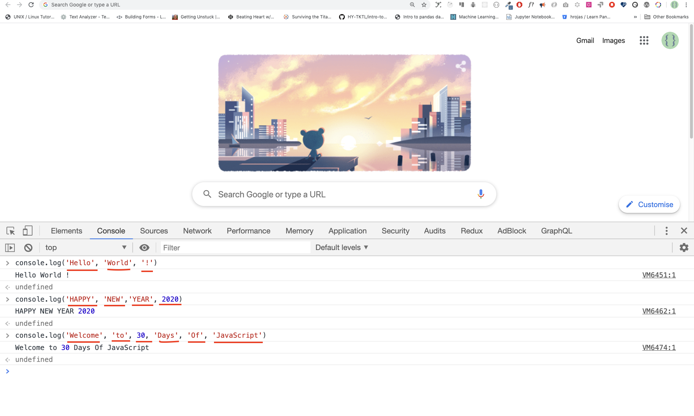

##### Console.log

Чтобы написать наш первый код JavaScript, мы использовали встроенную функцию **console.log()**. В качестве входных данных мы передавали аргумент, а функция выводила результат. В качестве входных данных или аргумента в функцию console.log() мы передали 'Hello, World'.

``js
console.log('Hello, World!')
```

##### Console.log с несколькими аргументами

Функция **conole.log()** может принимать несколько параметров, разделенных запятой. Синтаксис выглядит следующим образом:**console.log(param1, param2, param3)**.



``js
console.log('Hello', 'World', '!')
console.log('HAPPY', 'NEW', 'YEAR', 2020)
console.log('Welcome', 'to', 30, 'Days', 'Of', 'JavaScript')
```

Как видно из приведенного выше фрагмента кода, _console.log()_ может принимать несколько аргументов.

Поздравляем! Вы написали свой первый код JavaScript, используя _console.log()_.

##### Комментарии

Мы добавляем комментарии к нашему коду. Комментарии очень важны для того, чтобы сделать код более читабельным и оставить в нем замечания. JavaScript не выполняет часть нашего кода, содержащую комментарии. В JavaScript любая строка текста, начинающаяся с //, является комментарием, и все, что заключено в рамку, как здесь /\* \*/, также является комментарием.

**Пример: Однострочный комментарий**

// Это первый комментарий  
 // Это второй комментарий  
 // Я - однострочный комментарий

**Пример: Многострочный комментарий**

/_
Это многострочный комментарий  
 Многострочные комментарии могут занимать несколько строк  
 JavaScript - язык веба  
 _/

##### Синтаксис

Языки программирования похожи на человеческие языки. Английский или многие другие языки используют слова, фразы, предложения, сложносочиненные предложения и многое другое для передачи осмысленного сообщения. Синтаксис в английском языке означает _расположение слов и фраз для создания хорошо сформированных предложений в языке_. Техническое определение синтаксиса - это _структура высказываний в компьютерном языке._ Языки программирования имеют синтаксис. JavaScript - это язык программирования, и, как и другие языки программирования, он имеет свой собственный синтаксис. Если мы не напишем синтаксис, понятный JavaScript, он будет выдавать различные типы ошибок. Мы рассмотрим различные виды ошибок JavaScript позже. Пока же давайте рассмотрим синтаксические ошибки.


Я допустил намеренную ошибку. В результате консоль выдает синтаксическую ошибку. На самом деле, синтаксис очень информативен. Он сообщает, какой тип ошибки был допущен. Прочитав руководство по обратной связи с ошибками, мы можем исправить синтаксис и устранить проблему. Процесс выявления и устранения ошибок в программе называется отладкой. Давайте исправим ошибки:

``js
console.log('Hello, World!')
console.log('Hello, World!')
```

До сих пор мы видели, как выводить текст с помощью _console.log()_. Если мы печатаем текст или строку с помощью _console.log()_, текст должен находиться внутри одинарных, двойных или обратных кавычек.
**Пример:**

``js
console.log('Hello, World!')
console.log('Hello, World!')
console.log(`Hello, World!`)
```

#### Арифметика

Теперь давайте потренируемся писать JavaScript-коды, используя _console.log()_ в консоли google chrome для числовых типов данных.
Помимо текста, мы также можем выполнять математические вычисления с помощью JavaScript. Давайте выполним следующие простые вычисления.
Консоль может напрямую принимать аргументы без функции **_console.log()_**. Однако она включена в это введение, поскольку большая часть этой задачи будет решаться в текстовом редакторе, где использование этой функции будет обязательным. Вы можете играть непосредственно с инструкциями на консоли.


``js
console.log(2 + 3) // Сложение
console.log(3 - 2) // Вычитание
console.log(2 * 3) // Умножение
console.log(3 / 2) // Деление
console.log(3 % 2) // Модуль - нахождение остатка
console.log(3 ** 2) // Экспоненция 3 ** 2 == 3 * 3
```


```

## Комментарии снова

Помните, что комментирование в JavaScript аналогично другим языкам программирования. Комментарии важны для того, чтобы сделать ваш код более читабельным.
Существует два способа комментирования:

- _Однострочное комментирование_
- _Многострочное комментирование_

``js
// комментирование самого кода одним комментарием
// let firstName = 'Asabeneh'; однострочный комментарий
// let lastName = 'Yetayeh'; однострочный комментарий
```

Многострочное комментирование:

``js
/*
    Пусть местоположение = 'Хельсинки';
    пусть возраст = 100;
    let isMarried = true;
    Это многострочный комментарий
    */
```

## Переменные

Переменные - это _контейнеры_ данных. Переменные используются для _хранения_ данных в ячейке памяти. Когда переменная объявляется, место в памяти резервируется. Когда переменной присваивается значение (данные), место в памяти заполняется этими данными. Чтобы объявить переменную, мы используем ключевые слова _var_, _let_ или _const_.

Для переменной, которая изменяется в разное время, мы используем _let_. Если данные не меняются вообще, мы используем _const_. Например, PI, название страны, гравитация не меняются, и мы можем использовать _const_. Мы не будем использовать var в этой задаче, и я не рекомендую вам использовать его. Это ошибочный способ объявления переменной, он имеет много утечек. Более подробно о var, let и const мы поговорим в других разделах (область применения). На данный момент вышеприведенного объяснения достаточно.

Правильное имя переменной JavaScript должно соответствовать следующим правилам:

- Имя переменной JavaScript не должно начинаться с цифры.
- В имени переменной JavaScript не допускаются специальные символы, кроме знака доллара и подчеркивания.
- Имя переменной JavaScript следует соглашению camelCase.
- В имени переменной JavaScript не должно быть пробелов между словами.

Ниже приведены примеры допустимых переменных JavaScript.

``js
firstName
lastName
country
city
capitalCity
age
isMarried

first_name
last_name
is_married
capital_city

num1
num_1
_num_1
$num1
year2020
year_2020
```

Первая и вторая переменные в списке соответствуют соглашению о декларировании в camelCase в JavaScrip. В этом материале мы будем использовать переменные в camelCase.

Пример недопустимых переменных:

``sh
  first-name
  1_num
  num_#_1
```

Давайте объявим переменные с различными типами данных. Чтобы объявить переменную, перед именем переменной нужно использовать ключевое слово _let_ или _const_. После имени переменной пишем знак равенства (оператор присваивания) и значение (присваиваемые данные).

``js
// Синтаксис
let nameOfVariable = value
```

**Примеры объявленных переменных**

``js
// Объявление различных переменных с разными типами данных
let firstName = 'Asabeneh' // первое имя человека
let LastName = 'Yetayeh' // фамилия человека
let country = 'Finland' // страна
let city = 'Helsinki' // столица
let age = 100 // возраст в годах
let isMarried = true

console.log(firstName, lastName, country, city, age, isMarried)
```

``sh
Asabeneh Yetayeh Finland Helsinki 100 True
```

``js
// Объявление переменных с числовыми значениями
let age = 100 // возраст в годах
const gravity = 9.81 // сила тяжести Земли в м/с2
const boilingPoint = 100 // точка кипения воды, температура в oC
const PI = 3,14 // геометрическая константа

console.log(gravity, boilingPoint, PI)
```

``sh
9.81 100 3.14
```

``js
// Переменные также могут быть объявлены в одной строке через запятую
let name = 'Asabeneh', // имя человека
  job = 'teacher',
  live = 'Finland'
console.log(name, job, live)
```

``sh
Учитель Асабенех Финляндия
```


# 📔 День 2

## Типы данных
Данные или значения имеют типы данных. Типы данных описывают характеристики данных. Типы данных можно разделить на два:

1. Примитивные типы данных
2. Непримитивные типы данных (объектные ссылки)

### Примитивные типы данных

Примитивные типы данных в JavaScript включают:

 1. Numbers - Integers, floats (целые числа, плавающие числа)
 2. Строки - любые данные, заключенные в одинарную, двойную или обратную кавычку.
 3. Булевы - истинное или ложное значение
 4. Null - пустое значение или отсутствие значения
 5. Неопределенная - объявленная переменная без значения

Непримитивные типы данных в JavaScript включают:

1. Объекты (Object)
2. Функции (Function)
3. Массивы (Array)

Теперь давайте посмотрим, что именно означают примитивные и непримитивные типы данных.
*Примитивные* типы данных - это неизменяемые (не изменяемые) типы данных. После создания примитивного типа данных мы не можем его изменить.

**Пример:**

``js
let word = 'JavaScript'
```

Если мы попытаемся изменить строку, хранящуюся в переменной *word*, JavaScript должен выдать ошибку. Любой тип данных под одинарной, двойной или обратной кавычкой является строковым типом данных.

``js
word[0] = 'Y'
```

Это выражение не изменяет строку, хранящуюся в переменной *word*. Таким образом, можно сказать, что строки не изменяемы или, другими словами, неизменяемы.
Примитивные типы данных сравниваются по их значениям. Давайте сравним различные значения данных. Смотрите пример ниже:

``js
let numOne = 3
let numTwo = 3

console.log(numOne == numTwo) // true

let js = 'JavaScript'
let py = 'Python'

console.log(js == py) //false 

let lightOn = true
let lightOff = false

console.log(lightOn == lightOff) // false
```

### Непримитивные типы данных

*Непримитивные* типы данных являются изменяемыми или мутабельными. Мы можем изменять значение непервичных типов данных после их создания.
Давайте посмотрим на примере создания массива. Массив - это список значений данных в квадратной скобке. Массивы могут содержать одинаковые или разные типы данных. На значения массива ссылаются по их индексу. В JavaScript индекс массива начинается с нуля. То есть первый элемент массива находится по нулевому индексу, второй элемент - по первому, третий - по второму и т.д.

``js
let nums = [1, 2, 3]
nums[0] = 10

console.log(nums) // [10, 2, 3]
```

Как вы видите, массив, который является непервичным типом данных, является изменяемым. Непримитивные типы данных нельзя сравнивать по значению. Даже если два непримитивных типа данных имеют одинаковые свойства и значения, они не являются строго равными.

``js
let nums = [1, 2, 3]
let numbers = [1, 2, 3]

console.log(nums == numbers) // false

let userOne = {
name:'Asabeneh',
role:'teaching',
country:'Finland'
}

let userTwo = {
name:'Asabeneh',
role:'teaching',
country:'Finland'
}

console.log(userOne == userTwo) // false
```

Эмпирическое правило: не сравнивать непервичные типы данных. Не сравнивайте массивы, функции или объекты.
Непримитивные значения называются ссылочными типами, поскольку они сравниваются по ссылке, а не по значению. Два объекта строго равны только в том случае, если они ссылаются на один и тот же базовый объект.

``js
let nums = [1, 2, 3]
let numbers = nums

console.log(nums == numbers) // true

let userOne = {
name:'Asabeneh',
role:'teaching',
country:'Finland'
}

let userTwo = userOne

console.log(userOne == userTwo) // true
```

Если вам трудно понять разницу между примитивными и непримитивными типами данных, вы не единственный. Успокойтесь и просто перейдите к следующему разделу и постарайтесь вернуться к нему через некоторое время. Теперь давайте начнем рассмотрение типов данных с типа числа.

## Числа

Числа - это целые и десятичные числа, которые могут выполнять все арифметические операции.
Рассмотрим некоторые примеры Чисел.

### Объявление числовых типов данных

``js
let age = 35
const gravity = 9.81 // мы используем const для неизменяющихся значений, гравитационная постоянная в м/с2
let mass = 72 // масса в килограммах
const PI = 3.14 // пи - геометрическая константа

// Больше примеров
const boilingPoint = 100 // температура в oC, температура кипения воды, которая является константой
const bodyTemp = 37 // oC средняя температура тела человека, которая является константой

console.log(возраст, гравитация, масса, PI, boilingPoint, bodyTemp)
```

### Математический объект

В JavaScript объект Math предоставляет множество методов для работы с числами.

``js
const PI = Math.PI

console.log(PI) // 3.141592653589793

// Округление до ближайшего числа
// если больше 0,5, то округление вверх, если меньше 0,5, то округление вниз

console.log(Math.round(PI))                // 3 для округления значений до ближайшего числа

console.log(Math.round(9.81)) // 10

console.log(Math.floor(PI))                // 3 округление вниз

console.log(Math.ceil(PI))                 // 4 округление

console.log(Math.min(-5, 3, 20, 4, 5, 10)) // -5, возвращает минимальное значение

console.log(Math.max(-5, 3, 20, 4, 5, 10)) // 20, возвращает максимальное значение

const randNum = Math.random() // создает случайное число в диапазоне от 0 до 0,999999
console.log(randNum)

// Давайте создадим случайное число от 0 до 10

const num = Math.floor(Math.random () * 11) // создает случайное число между 0 и 10
console.log(num)

//Абсолютная величина
console.log(Math.abs(-10)) // 10

//Квадратный корень
console.log(Math.sqrt(100)) // 10

console.log(Math.sqrt(2))       // 1.4142135623730951

// Власть
console.log(Math.pow(3, 2))     // 9

console.log(Math.E) // 2.718

// Логарифм
// Возвращает натуральный логарифм с основанием E от x, Math.log(x)
console.log(Math.log(2))        // 0.6931471805599453
console.log(Math.log(10)) // 2.302585092994046

// Тригонометрия
Math.sin(0)
Math.sin(60)

Math.cos(0)
Math.cos(60)
```

#### Генератор случайных чисел

Математический объект JavaScript имеет генератор чисел метода random(), который генерирует число от 0 до 0.999999999....

``js
let randomNum = Math.random() // генерирует от 0 до 0.999...
```

Теперь давайте посмотрим, как можно использовать метод random() для генерации случайного числа от 0 до 10:

``js
let randomNum = Math.random() // генерирует от 0 до 0,999
let numBtnZeroAndTen = randomNum * 11

console.log(numBtnZeroAndTen) // это дает: min 0 и max 10.99

let randomNumRoundToFloor = Math.floor(numBtnZeroAndTen)
console.log(randomNumRoundToFloor) // это дает значение от 0 до 10
```

## Строки

Строки - это тексты, которые находятся под **_одиночной_**, **_двойной_**, **_обратной_** кавычкой. Чтобы объявить строку, нам нужно имя переменной, оператор присваивания, значение под одинарной, двойной или обратной кавычкой.
Рассмотрим некоторые примеры строк:

``js
let space = ' ' // пустая строка с пробелами
let firstName = 'Asabeneh'
let LastName = 'Yetayeh'
let country = 'Финляндия'
let city = 'Хельсинки'
let language = 'JavaScript'
let job = 'учитель'
let quote = "Поговорка "Видеть - значит верить" не верна в 2020 году".
let quotWithBackTick = `Поговорка "Видеть - значит верить" не верна в 2020 году.`
```

### Конкатенация строк

Соединение двух или более строк вместе называется конкатенацией.
Используя строки, объявленные в предыдущем разделе String:

``js
let fullName = firstName + space + lastName; // конкатенация, объединение двух строк вместе.
console.log(fullName);
```

``sh
Асабене Йетайех
```

Мы можем конкатенировать строки разными способами.

#### Конкатенация с использованием оператора сложения

Конкатенация с использованием оператора сложения - это старый способ. Такой способ конкатенации утомителен и чреват ошибками. Хорошо знать, как выполнять конкатенацию таким способом, но я настоятельно рекомендую использовать шаблонные строки ES6 (об этом позже).

``js
// Объявление различных переменных с разными типами данных
let space = ' '
let firstName = 'Asabeneh'
let LastName = 'Yetayeh'
let country = 'Финляндия'
let city = 'Хельсинки'
let language = 'JavaScript'
let job = 'учитель'
let age = 250


let fullName =firstName + пробел + lastName
let personInfoOne = fullName + '. Мне ' + возраст + '. Я живу в ' + стране; // ES5 добавление строки

console.log(personInfoOne)
```

``sh
Асабене Йетайех. Мне 250 лет. Я живу в Финляндии
```

#### Длинные буквенные строки

Строка может быть одним символом, абзацем или страницей. Если длина строки слишком велика, она не помещается в одной строке. Мы можем использовать символ обратной косой черты (\\\) в конце каждой строки, чтобы указать, что строка будет продолжена на следующей строке.
**Пример:**

``js
const paragraph = "Меня зовут Асабенех Йетайех. Я живу в Финляндии, Хельсинки.\
Я преподаватель и люблю преподавать. Я преподаю HTML, CSS, JavaScript, React, Redux, \
Node.js, Python, анализ данных и D3.js для всех, кому интересно учиться. \
В конце 2019 года я думаю расширить свою преподавательскую деятельность и достичь \
для глобальной аудитории, и я начал Python challenge с 20 ноября по 19 декабря.\
Это был один из самых полезных и вдохновляющих опытов.\
Сейчас мы находимся в 2020 году. Я наслаждаюсь подготовкой задачи 30DaysOfJavaScript и \
Надеюсь, вам тоже нравится".

console.log(paragraph)
```

#### Последовательности экранирования в строках

В JavaScript и других языках программирования \, за которой следуют некоторые символы, является управляющей последовательностью. Рассмотрим наиболее распространенные символы экранирования:

- \n: новая линия
- \t: Tab, означает 8 пробелов
- \\\\: Обратная косая черта
- \\': Одинарная кавычка (')
- \\": Двойная кавычка ("")
  
``js
console.log('Надеюсь, всем нравится 14 Days Of JavaScript challenge.\n А вам?') // перенос строки
console.log('Days\tTopics\tExercises')
console.log('День 1\t3\t5')
console.log('День 2\t3\t5')
console.log('День 3\t3\t5')
console.log('День 4\t3\t5')
console.log('Это символ обратной косой черты (\\)') // Чтобы написать обратную косую черту
console.log('В каждом языке программирования он начинается с \"Hello, World!\"')
console.log("В каждом языке программирования он начинается с \'Hello, World!\'")
console.log('Поговорка \"Видеть - значит верить\" не верна в 2020 году')
```

Вывод в консоль:

``sh
Я надеюсь, что всем нравится задача "14 Days Of JavaScript".
А вы?
Дни Темы Упражнения
День 1 3 5
День 2 3 5
День 3 3 5
День 4 3 5
Это символ обратной косой черты (\)
В каждом языке программирования он начинается со слов "Hello, World!".
В каждом языке программирования он начинается с "Hello, World!".
Поговорка "Видеть - значит верить" не верна в 2020 году
```

#### Шаблонные литералы (строки шаблонов)

Чтобы создать шаблонную строку, мы используем две обратные ссылки. Мы можем вводить данные в виде выражений внутрь строки-шаблона. Чтобы ввести данные, мы заключаем выражение в фигурную скобку ({}), перед которой ставится знак $. Смотрите синтаксис ниже.

``js
//Syntax
`Строчный литеральный текст`
`Строковый литеральный текст ${выражение}`.
```

**Пример: 1**

``js
console.log(`Сумма 2 и 3 равна 5`) // статическая запись данных
let a = 2
let b = 3
console.log(`Сумма ${a} и ${b} равна ${a + b}`) // динамическая инъекция данных
```

**Пример:2**

``js
let firstName = 'Asabeneh'
let LastName = 'Yetayeh'
let country = 'Финляндия'
let city = 'Хельсинки'
let language = 'JavaScript'
let job = 'учитель'
let age = 250
let fullName = firstName + ' ' + lastName

let personInfoTwo = `Я ${полное имя}. Мне ${возраст}. Я живу в ${страна}.` //ES6 - Метод интерполяции строк
let personInfoThree = `I am ${fullName}. Я живу в ${город}, ${страна}. Я работаю по специальности ${job}. Я преподаю ${язык}.
console.log(personInfoTwo)
console.log(personInfoThree)
```

``sh
Я Асабенех Йетайех. Мне 250 лет. Я живу в Финляндии.
Меня зовут Асабенех Йетайех. Я живу в Хельсинки, Финляндия. Я преподаватель. Я преподаю JavaScript.
```

Используя шаблон строки или метод интерполяции строк, мы можем добавлять выражения, которые могут быть значением или некоторыми операциями (сравнение, арифметические операции, троичная операция).

``js
let a = 2
let b = 3
console.log(`${a} больше, чем ${b}: ${a > b}`)
```

``sh
2 больше 3: false
```

### Строковые методы

Все в JavaScript является объектом. Строка - это примитивный тип данных, что означает, что мы не можем изменить ее после создания. Объект string имеет множество строковых методов. Существуют различные методы строк, которые могут помочь нам работать со строками.

1. *length*: Метод *length* возвращает количество символов в строке, включая пустое пространство.

**Пример:**

``js
let js = 'JavaScript'
console.log(js.length) // 10
let firstName = 'Asabeneh'
console.log(firstName.length) // 8
```

2. *Доступ к символам в строке*: Мы можем получить доступ к каждому символу в строке, используя его индекс. В программировании счет начинается с 0. Первый индекс строки равен нулю, а последний индекс - это длина строки минус один.

  
  
Давайте обратимся к различным символам в строке 'JavaScript'.

``js
let string = 'JavaScript'
let firstLetter = string[0]

console.log(firstLetter) // J

let secondLetter = string[1] // a
let thirdLetter = string[2]
let lastLetter = string[9]

console.log(lastLetter) // t

let lastIndex = string.length - 1

console.log(lastIndex) // 9
console.log(string[lastIndex]) // t
```

3. *toUpperCase()*: этот метод изменяет строку на заглавные буквы.

``js
let string = 'JavaScript'

console.log(string.toUpperCase()) // JAVASCRIPT

let firstName = 'Asabeneh'

console.log(firstName.toUpperCase()) // ASABENEH

let country = 'Финляндия'

console.log(country.toUpperCase()) // ФИНЛЯНДИЯ
```

4. *toLowerCase()*: этот метод изменяет строку на строчные буквы.

``js
let string = 'JavasCript'

console.log(string.toLowerCase()) // javascript

let firstName = 'Asabeneh'

console.log(firstName.toLowerCase()) // asabeneh

let country = 'Финляндия'

console.log(country.toLowerCase()) // finland
```

5. *substr()*: Принимает два аргумента, начальный индекс и количество символов для нарезки.

``js
let string = 'JavaScript'
console.log(string.substr(4,6)) // Сценарий

let country = 'Финляндия'
console.log(country.substr(3, 4))   // земля
```

6. *substring()*: Принимает два аргумента, начальный и конечный индекс, но не включает символ в конечный индекс.

``js
let string = 'JavaScript'

console.log(string.substring(0,4))     // Java
console.log(string.substring(4,10)) // Сценарий
console.log(string.substring(4))       // Сценарий

let country = 'Финляндия'

console.log(country.substring(0, 3)) // Fin
console.log(country.substring(3, 7))   // земля
console.log(country.substring(3)) // земля
```

7. *split()*: Метод split разделяет строку в указанном месте.

``js
let string = '14 Days Of JavaScript'

console.log(string.split()) // Изменения в массиве -> ["14 Days Of JavaScript"]
console.log(string.split(' '))  // Сплит в массив через пробел -> ["30", "Days", "Of", "JavaScript"]

let firstName = 'Asabeneh'

console.log(firstName.split()) // Изменить на массив - > ["Asabeneh"].
console.log(firstName.split(''))  // Разбиваем на массивы по каждой букве -> ["A", "s", "a", "b", "e", "n", "e", "h"].

let страны = 'Финляндия, Швеция, Норвегия, Дания и Исландия'

console.log(countries.split(','))  // разбиваем на любой массив через запятую -> ["Финляндия", " Швеция", " Норвегия", " Дания", " и Исландия"].
console.log(countries.split(', ')) // ["Финляндия", "Швеция", "Норвегия", "Дания", "и Исландия"].
```

8. *trim()*: Удаляет пробел в начале или конце строки.

``js
let string = ' 14 Days Of JavaScript '

console.log(string)
console.log(string.trim(' '))

let firstName = ' Asabeneh '

console.log(firstName)
console.log(firstName.trim()) // по-прежнему удаляет пробелы в начале и конце строки
```

``sh
   14 Days Of JavaScript   
14 Days Of JavaScript
  Asabeneh 
Asabeneh
```

9. *includes()*: Принимает аргумент подстроки и проверяет, существует ли аргумент подстроки в строке. *includes()* возвращает булево значение. Если подстрока существует в строке, возвращается true, в противном случае - false.

``js
let string = '14 Days Of JavaScript'

console.log(string.includes('Days'))     // true
console.log(string.includes('days'))     // false - он чувствителен к регистру!
console.log(string.includes('Script'))   // true
console.log(string.includes('script'))   // false
console.log(string.includes('java'))     // false
console.log(string.includes('Java'))     // true

let country = 'Финляндия'

console.log(country.includes('fin'))     // false
console.log(country.includes('Fin'))     // true
console.log(country.includes('land'))    // true
console.log(country.includes('Land'))    // false
```

10. *replace()*: принимает в качестве параметра старую подстроку и новую подстроку.

``js
string.replace(oldsubstring, newsubstring)
```

``js
let string = '14 Days Of JavaScript'
console.log(string.replace('JavaScript', 'Python')) // 30 Days Of Python

let country = 'Финляндия'
console.log(country.replace('Fin', 'Noman'))       // Номанландия
```

11. *charAt()*: Берет индекс и возвращает значение по этому индексу

``js
string.charAt(index)
```

``js
let string = '14 Days Of JavaScript'
console.log(string.charAt(0)) // 3

let lastIndex = string.length - 1
console.log(string.charAt(lastIndex)) // t
```

12. *charCodeAt()*: Берет индекс и возвращает char-код (ASCII номер) значения по этому индексу.

``js
string.charCodeAt(index)
```

``js
let string = '14 Days Of JavaScript'
console.log(string.charCodeAt(3)) // Число D ASCII равно 68

let lastIndex = string.length - 1
console.log(string.charCodeAt(lastIndex)) // t ASCII равен 116

```

13.  *indexOf()*: Берет подстроку и, если подстрока существует в строке, возвращает первую позицию подстроки, если не существует, возвращает -1

``js
string.indexOf(substring)
```

``js
let string = '14 Days Of JavaScript'

console.log(string.indexOf('D'))          // 3
console.log(string.indexOf('Days'))       // 3
console.log(string.indexOf('days'))       // -1
console.log(string.indexOf('a'))          // 4
console.log(string.indexOf('JavaScript')) // 11
console.log(string.indexOf('Script'))     //15
console.log(string.indexOf('script'))     // -1
```

14.  *lastIndexOf()*: Берет подстроку и, если подстрока существует в строке, возвращает последнюю позицию подстроки, если не существует, возвращает -1


``js
//syntax
string.lastIndexOf(substring)
```

``js
let string = 'Я люблю JavaScript. Если вы не любите JavaScript, что еще вы можете любить.'

console.log(string.lastIndexOf('love'))       // 67
console.log(string.lastIndexOf('you'))        // 63
console.log(string.lastIndexOf('JavaScript')) // 38
```

15. *concat()*: берет множество подстрок и объединяет их.

``js
string.concat(substring, substring, substring)
```

``js
let string = '30'
console.log(string.concat("Days", "Of", "JavaScript")) // 30DaysOfJavaScript

let country = 'Фин'
console.log(country.concat("land")) // Финляндия
```

16. *startsWith*: принимает подстроку в качестве аргумента и проверяет, начинается ли строка с указанной подстроки. Возвращает булево значение (true или false).

``js
//syntax
string.startsWith(substring)
```

``js
let string = 'Любовь - лучшее, что есть в этом мире'

console.log(string.startsWith('Love'))   // true
console.log(string.startsWith('love'))   // false
console.log(string.startsWith('world'))  // false

let country = 'Финляндия'

console.log(country.startsWith('Fin'))   // true
console.log(country.startsWith('fin'))   // false
console.log(country.startsWith('land'))  // false
```

17. *endsWith*: принимает подстроку в качестве аргумента и проверяет, заканчивается ли строка указанной подстрокой. Возвращает булево значение (true или false).

``js
string.endsWith(substring)
```

``js
let string = 'Любовь - самое сильное чувство в мире'

console.log(string.endsWith('world'))         // true
console.log(string.endsWith('love'))          // false
console.log(string.endsWith('in the world')) // true

let country = 'Финляндия'

console.log(country.endsWith('land'))         // true
console.log(country.endsWith('fin'))          // false
console.log(country.endsWith('Fin'))          // false
```

18. *search*: принимает подстроку в качестве аргумента и возвращает индекс первого совпадения. Значение поиска может быть строкой или шаблоном регулярного выражения.

``js
string.search(substring)
```

``js
let string = 'Я люблю JavaScript. Если вы не любите JavaScript, что еще вы можете любить.'
console.log(string.search('love'))          // 2
console.log(string.search(/javascript/gi))  // 7
```

19. *match*: принимает в качестве аргумента подстроку или шаблон регулярного выражения и возвращает массив, если есть совпадение, если нет, то возвращает null. Давайте посмотрим, как выглядит шаблон регулярного выражения. Он начинается со знака / и заканчивается знаком /.

``js
let string = 'любовь'
let patternOne = /love/ // без флага
let patternTwo = /love/gi // g-значение для поиска во всем тексте, i - нечувствительность к регистру
```

Синтаксис матча

``js
// синтаксис
string.match(substring)
```

``js
let string = 'Я люблю JavaScript. Если вы не любите JavaScript, что еще вы можете любить.'
console.log(string.match('love'))
```

``sh
["любовь", индекс: 2, ввод: "Я люблю JavaScript. Если вы не любите JavaScript, что еще вы можете любить.", группы: неопределено]
```

``js
let шаблон = /love/gi
console.log(string.match(pattern))   // ["любовь", "любовь", "любовь"].
```

Давайте извлечем числа из текста с помощью регулярного выражения. Это не раздел регулярных выражений, не паникуйте! Мы рассмотрим регулярные выражения позже.

``js
let txt = 'В 2019 году я пробежал 30 дней Python. Теперь, в 2020 году, мне не терпится начать это испытание".
let regEx = /\d+/

// d с экранирующим символом означает, что d не обычная d, а действует как цифра
// + означает один или несколько разрядов числа,
// если после этого стоит g, это означает глобальный, повсеместный поиск.

console.log(txt.match(regEx))  // ["2", "0", "1", "9", "3", "0", "2", "0", "2", "0"]
console.log(txt.match(/\d+/g)) // ["2019", "30", "2020"]
```

20. *repeat()*: принимает число в качестве аргумента и возвращает повторяющуюся версию строки.

``js
string.repeat(n)
```

``js
let string = 'любовь'
console.log(string.repeat(10)) // любовь-морковь
```

## Проверка типов данных и приведение

### Проверка типов данных

Для проверки типа данных определенной переменной мы используем метод _typeof_.

**Пример:**

``js
// Различные типы данных javascript
// Давайте объявим различные типы данных

let firstName = 'Asabeneh' // string
let LastName = 'Yetayeh' // string
let country = 'Finland' // string
let city = 'Helsinki' // string
let age = 250 // число, это не мой реальный возраст, не беспокойтесь об этом
let job // не определено, потому что значение не было присвоено

console.log(typeof 'Asabeneh') // string
console.log(typeof firstName) // string
console.log(typeof 10) // число
console.log(typeof 3.14) // число
console.log(typeof true) // boolean
console.log(typeof false) // boolean
console.log(typeof NaN) // число
console.log(typeof job) // undefined
console.log(typeof undefined) // undefined
console.log(typeof null) // объект
```

### Изменение типа данных (Casting)

- Кастинг: Преобразование одного типа данных в другой тип данных. Мы используем _parseInt()_, _parseFloat()_, _Number()_, _+знак_, _str()_.
  Когда мы выполняем арифметические операции, строковые числа должны быть сначала преобразованы в целое число или float, если этого не происходит, то выдается ошибка.

#### String to Int

Мы можем преобразовать строковое число в число. Любое число, заключенное в кавычки, является строковым числом. Пример строкового числа: '10', '5' и т.д.
Мы можем преобразовать строку в число, используя следующие методы:

- parseInt()
- Number()
- Знак плюс (+)

``js
let num = '10'
let numInt = parseInt(num)
console.log(numInt) // 10
```

``js
let num = '10'
let numInt = Number(num)

console.log(numInt) // 10
```

``js
let num = '10'
let numInt = +num

console.log(numInt) // 10
```

#### Строка в плавающую величину

Мы можем преобразовать строковое число float в число float. Любое число с плавающей точкой внутри кавычек является строковым числом с плавающей точкой. Пример строкового плавающего числа: '9.81', '3.14', '1.44' и т.д.
Мы можем преобразовать строку float в число, используя следующие методы:

- parseFloat()
- Number()
- Знак плюс (+)

``js
let num = '9.81'
let numFloat = parseFloat(num)

console.log(numFloat) // 9.81
```

``js
let num = '9.81'
let numFloat = Number(num)

console.log(numFloat) // 9.81
```

``js
let num = '9.81'
let numFloat = +num

console.log(numInt) // 9.81
```

#### Float to Int

Мы можем преобразовать числа с плавающей точкой в целые числа.
Для преобразования float в int мы используем следующий метод:

- parseInt()
  
``js
let num = 9.81
let numInt = parseInt(num)

console.log(numInt) // 9
```

🌕 Вы великолепны. Вы только что завершили второй день испытаний, и вы на два шага впереди на пути к величию. Теперь сделайте несколько упражнений для мозга и для мышц.  

## 💻 День 2: Упражнения

### Упражнение: Уровень 1

1. Объявите переменную с именем challenge и присвойте ей начальное значение **'14 Days Of JavaScript'**.
2. Выведите строку на консоль браузера с помощью __console.log()__.
3. Выведите __длину__ строки на консоль браузера с помощью _console.log()_.
4. Измените все символы строки на заглавные буквы с помощью метода __toUpperCase()__.
5. Измените все символы строки на строчные буквы с помощью метода __toLowerCase()__.
6. Вырезать (вырезать) первое слово строки с помощью метода __substr()__ или __substring()__.
7. Вырежьте фразу *Days Of JavaScript* из *14 Days Of JavaScript*.
8. Проверьте, содержит ли строка слово __Script__, используя метод __includes()__.
9. Разделите __строку__ на __массив__ с помощью метода __split()__.
10. Разделите строку 14 Days Of JavaScript на пробелы с помощью метода __split()__
11. 'Facebook, Google, Microsoft, Apple, IBM, Oracle, Amazon' __разделите строку запятой и измените ее на массив.
12. Замените 14 Days Of JavaScript на 30 Days Of Python с помощью метода __replace()__.
13. Какой символ находится под индексом 15 в строке '14 Days Of JavaScript'? Используйте метод __charAt()__.
14. Какой символьный код J в строке '14 Days Of JavaScript', используя __charCodeAt()__.
15. Используйте __indexOf__ для определения позиции первого вхождения __a__ в 14 Days Of JavaScript
16. Используйте __lastIndexOf__ для определения позиции последнего вхождения __a__ в 14 Days Of JavaScript.
17. С помощью __indexOf__ найдите позицию первого появления слова __because__ в следующем предложении:__'Вы не можете закончить предложение словами because because because is a conjunction'__.
18. Используйте __lastIndexOf__, чтобы найти позицию последнего вхождения слова __because__ в следующем предложении:__'You cannot end a sentence with because because because is a conjunction'__.
19. С помощью __поиска__ найдите позицию первого появления слова __because__ в следующем предложении:__'You cannot end a sentence with because because because is a conjunction'__.
20. Используйте __trim()__ для удаления пробелов в начале и конце строки. Например, ' 14 Days Of JavaScript '.
21. Используйте метод __startsWith()__ со строкой *14 Days Of JavaScript* и сделайте результат true
22. Используйте метод __endsWith()__ со строкой *14 Days Of JavaScript* и сделайте результат истинным
23. Используйте метод __match()__, чтобы найти все __a__ в 14 Days Of JavaScript
24. Используйте __concat()__ и объедините '30 Days of' и 'JavaScript' в одну строку, '14 Days Of JavaScript'.
25. Используйте метод __repeat()__ для печати 14 Days Of JavaScript 2 раза

### Упражнение: Уровень 2

1. Используя console.log(), выведите следующее утверждение:

    ``sh
    Цитата Джона Холмса "Нет лучшего упражнения для сердца, чем тянуться вниз и поднимать людей" учит нас помогать друг другу.
    ```

2. С помощью console.log() выведите следующую цитату Матери Терезы:

    ``sh
    "Любовь не покровительствует, и благотворительность - это не жалость, а любовь. Благотворительность и любовь - это одно и то же: благотворительностью вы дарите любовь, поэтому не просто давайте деньги, а протягивайте руку".
    ```

3. Проверьте, точно ли typeof '10' равен 10. Если нет, сделайте его точно равным.
4. Проверьте, равен ли parseFloat('9.8') 10, если нет, то сделайте его равным 10.
5. Проверьте, встречается ли 'on' как в python, так и в жаргоне
6. Я надеюсь, что этот курс не перегружен жаргоном. Проверьте, есть ли _жаргон_ в предложении.
7. Сгенерируйте случайное число от 0 до 100 включительно.
8. Сгенерируйте случайное число в диапазоне от 50 до 100 включительно.
9. Сгенерируйте случайное число в диапазоне от 0 до 255 включительно.
10. Получите доступ к символам строки 'JavaScript', используя случайное число.
11. Используйте console.log() и управляющие символы для печати следующего шаблона.

    ``js
    1 1 1 1 1
    2 1 2 4 8
    3 1 3 9 27
    4 1 4 16 64
    5 1 5 25 125
    ```

12.  Используйте __substr__, чтобы вырезать фразу __потому что потому что__ из следующего предложения:__"Вы не можете закончить предложение словами потому что потому что потому что потому что потому что потому что потому что потому что потому что потому что потому что потому что потому что потому что потому что потому что потому что потому что потому что потому что потому что".

### Упражнения: Уровень 3

1. Любовь - лучшее, что есть в этом мире. Некоторые нашли свою любовь, а некоторые все еще ищут ее". Подсчитайте количество слов __love__ в этом предложении.
2. С помощью __match()__ подсчитайте количество всех __because__ в следующем предложении:__"Нельзя заканчивать предложение словами because, потому что because - это связка"__.
3. Очистите следующий текст и найдите наиболее часто встречающееся слово (подсказка, используйте замену и регулярные выражения).

    ``js
        const sentence = '%I $am@% a %tea@cher%, && I lo%#ve %te@a@ching%;. Нет ничего более полезного, чем обучение и @эмп%о@верирование людей. ;Я нахожу чаепитие более интересным, чем любое другое занятие. %Делает ли это мо@тивацию для вас быть чай@чером!? %Эти 30#Days&OfJavaScript &также $резу@льтат &любви& к чаепитию".
    ```

4. Рассчитайте общий годовой доход человека, извлекая числа из следующего текста. 'Он зарабатывает 5000 евро из зарплаты в месяц, 10000 евро годовой премии, 15000 евро в месяц на онлайн-курсах'.
